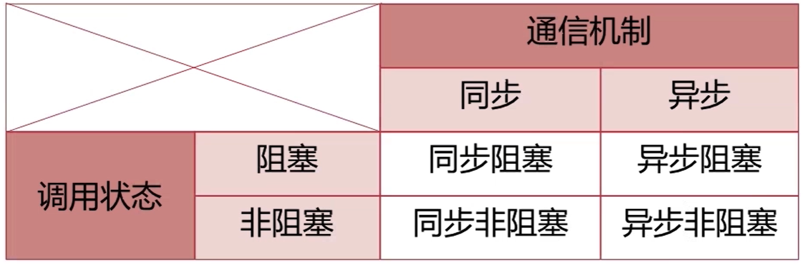
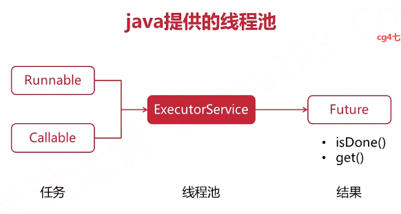
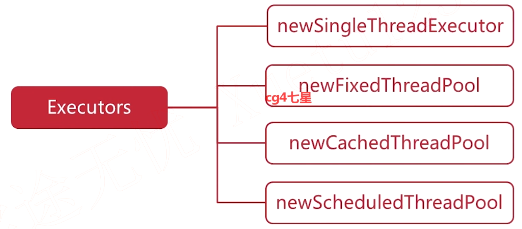
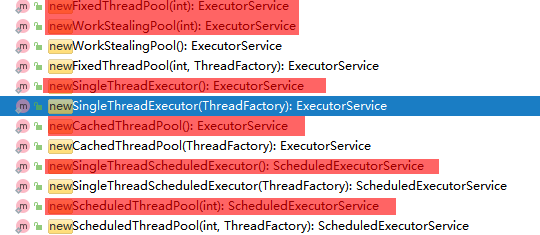

### 设计模式

#### 创建型模式（Creational Patterns）

- 创建型模式提供了创建对象的机制， 能够提升已有代码的灵活性和可复用性。

- 典型的是[单例模式](https://refactoringguru.cn/design-patterns/singleton)

  > 让你能够保证一个类只有一个实例， 并提供一个访问该实例的全局节点。

#### 结构型模式（Structural Patterns）

- 结构型模式介绍如何将对象和类组装成较大的结构， 并同时保持结构的灵活和高效。

- 典型的是[代理模式](https://refactoringguru.cn/design-patterns/proxy)

  > 让你能够提供对象的替代品或其占位符。 代理控制着对于原对象的访问， 并允许在将请求提交给对象前后进行一些处理。

#### 行为型模式（Behavioral Patterns）

- 行为模式负责对象间的高效沟通和职责委派。

- 典型的是[迭代器模式](https://refactoringguru.cn/design-patterns/iterator)

  > 迭代器模式是一种行为设计模式， 让你能在不暴露集合底层表现形式 （列表、 栈和树等） 的情况下遍历集合中所有的元素。

### 网络编程

#### 同步与阻塞

- Synchronous
- Asynchronous
- Blocking
- Nonblocking



#### java 提供的线程池







- FixedThreadPool：线程数固定的线程池；

- CachedThreadPool：线程数根据任务动态调整的线程池；

- SingleThreadExecutor：仅单线程执行的线程池；

- ScheduledThreadPool：任务可以定期反复执行；

  ```java
  ScheduledExecutorService ses = Executors.newScheduledThreadPool(4);
  // 1秒后执行一次性任务:
  ses.schedule(new Task("one-time"), 1, TimeUnit.SECONDS);
  // 2秒后开始执行定时任务，每3秒执行:FixedRate是指任务总是以固定时间间隔触发，不管任务执行多长时间
  ses.scheduleAtFixedRate(new Task("fixed-rate"), 2, 3, TimeUnit.SECONDS);
  // 2秒后开始执行定时任务，以3秒为间隔执行:FixedDelay是指，上一次任务执行完毕后，等待固定的时间间隔，再执行下一次任务
  ses.scheduleWithFixedDelay(new Task("fixed-delay"), 2, 3, TimeUnit.SECONDS);
  ```

- ThreadPoolExecutor：根据自己需要的场景来创建一个合适的线程池；

  > 推荐使用

#### 发展历程

> java.io 包下的设计模式
>
> - 装饰器

- Blocking IO
  - 
- NIO
- AIO

