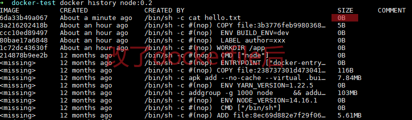

> 测试Dockerfile

```dockerfile
FROM node:14.16.1-alpine3.13
WORKDIR /app

LABEL author="xxx"
ENV BUILD_ENV=dev


COPY ./hello.txt ./

RUN echo aaaaaaaaabbbbbbbbbb>>hello.txt
# RUN cat hello.txt	
```

## layer 层

- Dockerfile 中那些命令会增加一层？

  - 除了配置类的参数，其他的都会增加一层

- 镜像的层与层之间有没有关系？

  - Copy On Write 写入时复制

    > 多个人读一个资源的时候，这个资源被共享给多个人去读，有人要写的话就copy一份给他写，其他没写的人还是用共享的。
    >
    > 多个镜像使用同一个image的时候，这个image被共享给多个镜像读取，有镜像要写自己的东西的时候copy单独一份共享的镜像给他，其他没写的镜像还是用共享的image。

    

    

  - 层和层之间存在着diff

## image 镜像

- 镜像是由层组成的

> 
>
> 


## container 容器

- 镜像和容器之间是啥关系？

  - 镜像是有多层的。
  - 当一个镜像构建完后，这个镜像的所有东西就是只读的了。
  - 当基于一个镜像去创建容器的时候就是又增加了一层。这一层就是可读可写的。
  - 容器要想写镜像中的东西，就先copy一层，这层可读可写。

  

- 不同容器之间有隔离，但是又基于一个写时复制的只读镜像，所以不会太占硬盘。
  


------

- ref
  - https://github.com/findxc/blog/issues/57
    docker 的 layer, image, container 概念梳理
  - [findxc的bilibili](https://www.bilibili.com/video/BV1mQ4y1X7VZ?spm_id_from=333.337.search-card.all.click)
  - [image和layer的关系](https://docs.docker.com/storage/storagedriver/#images-and-layers)