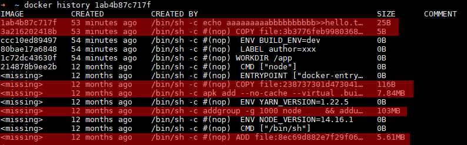
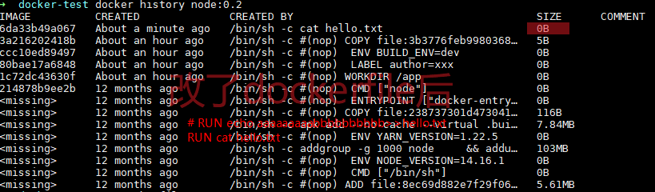
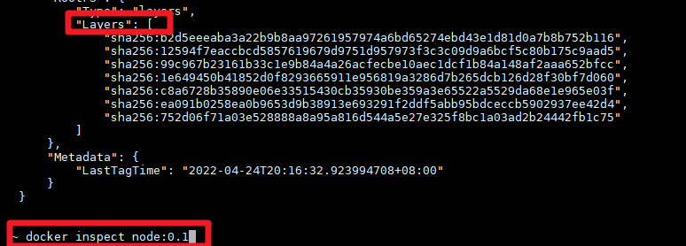
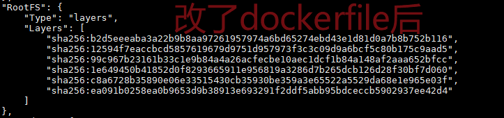
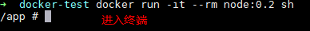
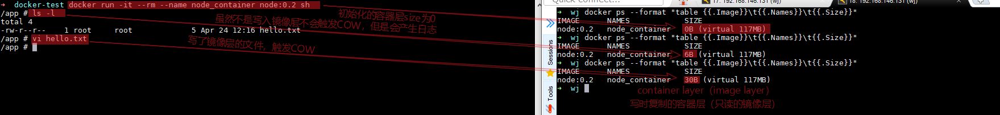

> 测试用的Dockerfile

```dockerfile
FROM node:14.16.1-alpine3.13
WORKDIR /app

LABEL author="xxx"
ENV BUILD_ENV=dev


COPY ./hello.txt ./ # echo test > hello.txt

RUN echo aaaaaaaaabbbbbbbbbb>>hello.txt
# RUN cat hello.txt	
```

## layer 层

- Dockerfile 中那些命令会增加一层？

  - 除了配置类的参数（ENV，LABEL等），其他的都会增加一层

- 镜像的层与层之间有没有关系？

  - Copy On Write 写入时复制

    > 写入时复制（英语：Copy-on-write，简称COW）是一种计算机程序设计领域的优化策略。其核心思想是，如果有多个调用者（callers）同时请求相同资源（如内存或磁盘上的数据存储），他们会共同获取相同的指针指向相同的资源，直到某个调用者试图修改资源的内容时，系统才会真正复制一份专用副本（private copy）给该调用者，而其他调用者所见到的最初的资源仍然保持不变。这过程对其他的调用者都是透明的。此作法主要的优点是如果调用者没有修改该资源，就不会有副本（private copy）被创建，因此多个调用者只是读取操作时可以共享同一份资源。

    > cow表现在docker中就是：几个image基于同一个image（假设叫foo）的时候，这个foo被共享给多个image读取，有image要写foo的某一层的东西（iamge由层组成）的时候把foo中这一层单独copy给他，其他没有写操作的镜像还是用共享的image。

    

    

  - 一个image的层和层之间存在着diff关系

## image 镜像

- 镜像是由层组成的

> 
>
> 


## container 容器

- 镜像和容器之间是啥关系？

  - 镜像是多个层组成的。
  - 当一个镜像构建完后，这个镜像的所有东西就是只读的了。
  - 当基于一个镜像去创建容器的时候就是又增加了一层。这一层就是可读可写的。
  - 容器要想写镜像中的东西，就先copy一层，这层可读可写。

  

- 不同容器之间有隔离，但是又基于一个写时复制的只读镜像，所以不会太占硬盘。
  
  
  - 
  - 
- 镜像和容器占用磁盘空间的计算
  - 对于镜像来说
    镜像是由层来组成的，有些层可能是多个镜像共享的。所以多个镜像的磁盘占用不一定就是求和，所以某些镜像的磁盘占用可能很低。
  - 对于容器来说
    一个镜像启动了多个容器，磁盘占用空间就是一个镜像的大小加多个容器层的大小的和。容器层会有copy on write产生的磁盘占用或者日志啥的。


------

- ref
  - https://github.com/findxc/blog/issues/57
    docker 的 layer, image, container 概念梳理
  - [findxc的bilibili](https://www.bilibili.com/video/BV1mQ4y1X7VZ?spm_id_from=333.337.search-card.all.click)
  - [image和layer的关系](https://docs.docker.com/storage/storagedriver/#images-and-layers)