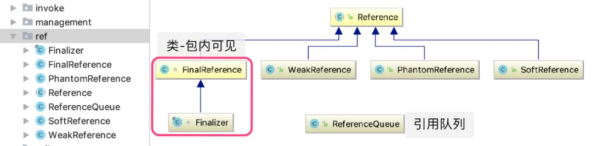
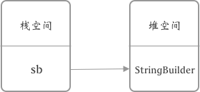
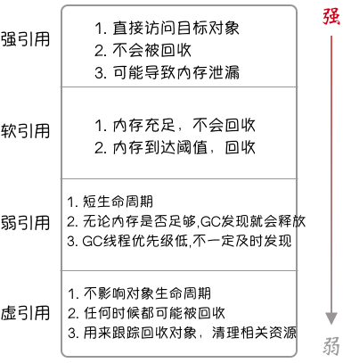
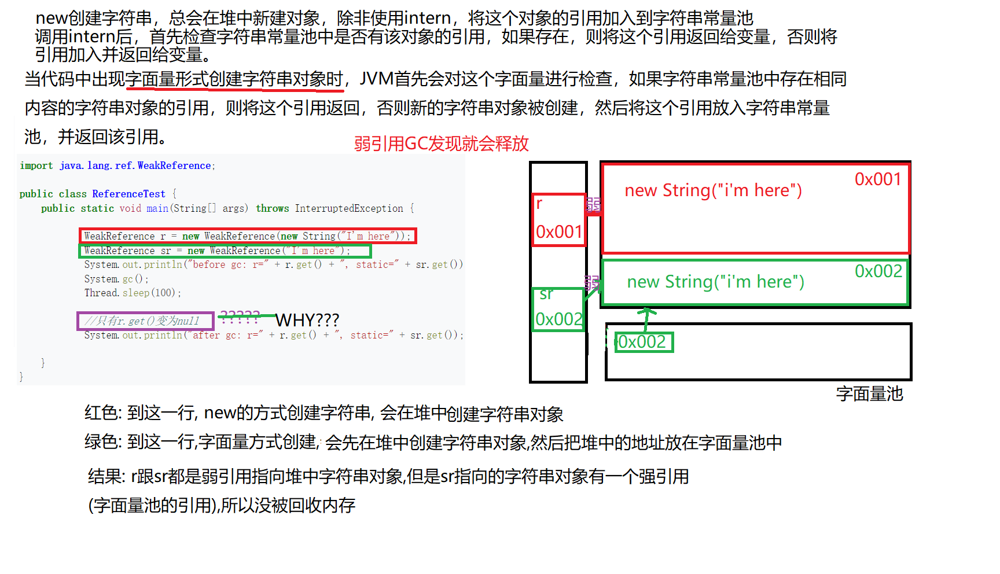

> # 强、软、弱、虚引用的区别和使用
>
> ^ https://mp.weixin.qq.com/s/DhqdfanI8VR67J5YFikPsA  这个错别字多, 但有代码例子, 图多
>
> ^ https://zh.wikipedia.org/zh-cn/%E5%BC%B1%E5%BC%95%E7%94%A8#Java wiki百科

# 结论

- 软引用(SoftReference)

  - 反射的数据都是软引用
  - 堆内存没有空间了才会释放干软引用的对象;

- 弱引用(WeekReference)

  - GC的时候, 只要发现弱引用都干掉, 不管堆内存有没有空间;

  - WeakHashMap

    当key只有弱引用时，GC发现后会自动清理键和值，作为简单的缓存表解决方案。

  - ThreadLocal

    ThreadLocal.ThreadLocalMap.Entry 继承了弱引用，key为当前线程实例，和WeakHashMap基本相同。

- 虚引用(PhantomReference)

  - 虚引用 就是 形同虚设 ，它并不能决定 对象的生命周期。任何时候这个只有虚引用的对象都有可能被回收。因此，虚引用主要用来跟踪对象的回收，清理被销毁对象的相关资源。PhantomReference的 get() 方法永远返回null ，而且**只提供了与引用队列同用的构造函数**。所以虚引用必须和引用队列一同使用。

- 强引用

  - 强引用在 java.lang.ref 中并没有实际的对应类型，但我们程序中几乎所有的引用使用的都是强引用。

    - `StringBuilder sb = new StringBuilder();`

    - 上面通过在堆中创建实例，然后赋值给栈中局部变量 sb 的方式 就是 强引用。

    - 注意：为了尽量避免浪费内存的情况，我们有时可以在变量sb不再使用后通过显示的将变量sb置为null（sb = null），来加速对象的回收。

      > 解释：
      >
      > 1. 内存溢出(out of memory) 是指 程序在申请内存时，没有足够的内存空间供其使用，出现 out of memory.  
      >
      > 2. 内存泄漏(memory leak) 是指 程序申请内存后，无法释放已申请的内存空间，这样的泄漏积少成多，memory leak 会导致 out of memory .

---

### 问题1

