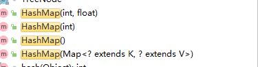

# 实现原理

> ^ [极客学院wiki](https://wiki.jikexueyuan.com/project/java-collection/hashmap.html)
>
> ^ [有or无符号右移](https://juejin.cn/post/6844903969915944973)

- HashMap 是基于哈希表的 Map 接口的**非同步**实现
  Hashmap 不是同步的，如果多个线程同时访问一个 HashMap，而其中至少一个线程从结构上（指添加或者删除一个或多个映射关系的任何操作）修改了，则必须保持外部同步，以防止对映射进行意外的非同步访问。
  - 同步：A执行一个操作，A等待操作返回执行结果，获得操作返回的结果，继续下一个操作
  - 非同步：A执行一个操作，A不等待操作返回结果，A直接执行下一个操作，操作使用回调函数返回结果。
- 不保证有序，不是保证无序
- 它是顺序存储结构+链式存储结构+自平衡二叉查找树(红黑树)

## 1：ADT


## 2：构造函数



- HashMap(初始化容量，负载因子)

  ```java
  public HashMap(int initialCapacity, float loadFactor) {
      // 对初始化容量做边界校验
      if (initialCapacity < 0)
          throw new IllegalArgumentException("Illegal initial capacity: " +
                  initialCapacity);
      if (initialCapacity > MAXIMUM_CAPACITY)
          initialCapacity = MAXIMUM_CAPACITY;
      // 对负载因子做边界校验
      if (loadFactor <= 0 || Float.isNaN(loadFactor))
          throw new IllegalArgumentException("Illegal load factor: " +
                  loadFactor);
      // 初始化边界容量和负载因子
      this.loadFactor = loadFactor;
      this.threshold = tableSizeFor(initialCapacity); // 初始化扩容阈值
  }
  ```

  ```java
  /**
  * The maximum capacity, used if a higher value is implicitly specified
    最大的容量，如果参数中initialCapaacity指定了更高的值，则使用 1<<30 aka ?
  * by either of the constructors with arguments.
    由任一带参数的构造参数。
  * MUST be a power of two <= 1<<30.
    必须是二的幂，小于等于 1<<30
    》 1<<30 有符号左移，将1左移30位
      BIN: 0_001 1110 , 第一位是符号位0是正数，1是负数
    》 1<<<30 无符号左移一位
  */
  static final int MAXIMUM_CAPACITY = 1 << 30;
  ```

  > [为啥是1左移30位？tableSizeFor干啥的？](https://blog.csdn.net/sayWhat_sayHello/article/details/83120324)

- HashMap(初始化容量)，默认负载因子=0.75

  ```java
  public HashMap(int initialCapacity) {
      this(initialCapacity, DEFAULT_LOAD_FACTOR);
  }
  ```

  ```java
  static final float DEFAULT_LOAD_FACTOR = 0.75f;
  ```

- HashMap()，默认负载因子=0.75，默认初始化容量=16

  ```java
  public HashMap() {
      this.loadFactor = DEFAULT_LOAD_FACTOR; // all other fields defaulted
      // 所有其他字段使用默认值
  }
  ```
  
  ```java
  /**
  * The default initial capacity - MUST be a power of two.
  默认初始化容量，必须是2的幂
  */
  static final int DEFAULT_INITIAL_CAPACITY = 1 << 4; // aka 16
  ```
  
  


## 3：存储

### put(K, V)

```java
public V put(K key, V value) {
    return putVal(hash(key), key, value, false, true);
}
```

```java
/**
     * Implements Map.put and related methods
       实现 Map.put 和相关方法
     * @param hash hash for key 
                   调用本类的静态的hash算法得出的key的hash值
     * @param key the key 
     				  键
     * @param value the value to put 
     				put过来的值
     * @param onlyIfAbsent if true, don't change existing value 
     					   如果为真，则不要更改现有值
     * @param evict if false, the table is in creation mode.
     				如果为 false，则表处于创建模式。
     * @return previous value, or null if none
     		   前一个值，如果没有，则为 null
*/
final V putVal(int hash, K key, V value, boolean onlyIfAbsent, boolean evict) {
    Node<K,V>[] tab; // 散列表
    Node<K,V> p; // i位置的元素
    int n, i; // n：散列表长读，i：算出的在tab中的位置，
    // 初始化散列表，使用resize()
    if ((tab = table) == null || (n = tab.length) == 0)
        n = (tab = resize()).length;
    if ((p = tab[i = (n - 1) & hash]) == null)
	    // 如果以tab为下标的元素为空，说明不存在hash冲突，直接存元素
        tab[i] = newNode(hash, key, value, null);
    else {
    	// 发生了散列冲突，
        Node<K,V> e; 
        K k; // key
        if (p.hash == hash &&
            // key的hash值相等 && (key的内存地址相同 || key的属性相同)
	        // 说明这个待插入的key在tab中已经存在 
            ((k = p.key) == key || (key != null && key.equals(k))))
            e = p; // hash表中已经存在将被插入的结点
        else if (p instanceof TreeNode)
            // 是TreeNode的情况特殊处理
            e = ((TreeNode<K,V>)p).putTreeVal(this, tab, hash, key, value);
        else {
            // 待插入的key在hash表中不存在，
            for (int binCount = 0; ; ++binCount) { // 从链表的头节点开始遍历
                // 找到单链表的表尾，可以进行插入
                if ((e = p.next) == null) {
                    p.next = newNode(hash, key, value, null); // 插入新节点
                    // 大于8转红黑树
                    if (binCount >= TREEIFY_THRESHOLD - 1) // -1 for 1st
                        treeifyBin(tab, hash);
                    break;
                }
                // key已经存在则直接覆盖value
                if (e.hash == hash &&
                    ((k = e.key) == key || (key != null && key.equals(k))))
                    break;
                p = e;
            }
        }
        // 覆盖value，返回oldValue
        if (e != null) { // existing mapping for key
            V oldValue = e.value;
            if (!onlyIfAbsent || oldValue == null)
                e.value = value;
            afterNodeAccess(e);
            return oldValue;
        }
    }
    ++modCount;
    // 超过最大容量就扩容
    if (++size > threshold)
        resize();
    afterNodeInsertion(evict);
    return null;
}

  /**
     * The bin count threshold for using a tree rather than list for a
     * bin.  Bins are converted to trees when adding an element to a
     * bin with at least this many nodes. The value must be greater
     * than 2 and should be at least 8 to mesh with assumptions in
     * tree removal about conversion back to plain bins upon
     * shrinkage.
  	 */
	static final int TREEIFY_THRESHOLD = 8;
```

- i = (n - 1) & hash 来得到该对象在数组中的下标，

  | (15-1)&hash(0)=0 	 1110&0=0 <br/>(15-1)&hash(1)=0 	 1110&1=0 <br/>(15-1)&hash(2)=2 	 1110&10=10 <br/>(15-1)&hash(3)=2 	 1110&11=10 <br/>(15-1)&hash(4)=4 	 1110&100=100 <br/>(15-1)&hash(5)=4 	 1110&101=100 | (16-1)&hash(0)=0 	 1111&0=0 <br/>(16-1)&hash(1)=1 	 1111&1=1 <br/>(16-1)&hash(2)=2 	 1111&10=10 <br/>(16-1)&hash(3)=3 	 1111&11=11 <br/>(16-1)&hash(4)=4 	 1111&100=100 <br/>(16-1)&hash(5)=5 	 1111&101=101 |
  | ------------------------------------------------------------ | ------------------------------------------------------------ |

  - 2的倍数的特性就出现了
  
    ```java
    // 测试用的代码
    public class Main {
        public static void main(String[] args) {
            // i = (n - 1) & hash
            int index = 0;
            for (int i = 0; i < 10; i++) {
                index = (16-1)&hash(i);
                String left = Integer.toBinaryString(16 - 1);
                String right = Integer.toBinaryString(hash(i));
                String indexB = Integer.toBinaryString(index);
                System.out.printf("(%d-%d)&hash(%d)=%d \t %s&%s=%s \n",16,1,i,index, left,right,indexB);
            }
        }
        static final int hash(Object key) {
            int h;
            return (key == null) ? 0 : (h = key.hashCode()) ^ (h >>> 16);
        }
    }
    ```
  
- ```java
    
  ```


### hash算法

```java
/**
     * Computes key.hashCode() and spreads (XORs) higher bits of hash
     * to lower.  Because the table uses power-of-two masking, sets of
     * hashes that vary only in bits above the current mask will
     * always collide. (Among known examples are sets of Float keys
     * holding consecutive whole numbers in small tables.)  So we
     * apply a transform that spreads the impact of higher bits
     * downward. There is a tradeoff between speed, utility, and
     * quality of bit-spreading. Because many common sets of hashes
     * are already reasonably distributed (so don't benefit from
     * spreading), and because we use trees to handle large sets of
     * collisions in bins, we just XOR some shifted bits in the
     * cheapest possible way to reduce systematic lossage, as well as
     * to incorporate impact of the highest bits that would otherwise
     * never be used in index calculations because of table bounds.
*/
static final int hash(Object key) {
    int h;
    return (key == null) ? 0 : (h = key.hashCode()) ^ (h >>> 16);
}
```

- (h = key.hashCode()) ^ (h >>> 16)
  - key的hashcode ^ key的hashcode无符号右移16位

------


## 4：读取

> 略

## 5：扩容

### 为啥要扩容？

### threshold，扩容阈值

```java
/**
* The next size value at which to resize (capacity * load factor).
*/
int threshold;
```

threshold 在 构造函数里初始化，通过tableSizeFor()

```java
this.threshold = tableSizeFor(initialCapacity); // 初始化扩容阈值
```

### resize()，为啥数组长度是2的n次幂？

> 1：数组长度：太小了resize频繁，太大了浪费空间，
> 2：在putVal 计算在tab的下标的时候可以减少冲突

```java
final HashMap.Node<K,V>[] resize() {
    HashMap.Node<K,V>[] oldTab = table;
    int oldCap = (oldTab == null) ? 0 : oldTab.length;
    int oldThr = threshold;
    int newCap, newThr = 0;
    if (oldCap > 0) {
        if (oldCap >= MAXIMUM_CAPACITY) {
            threshold = Integer.MAX_VALUE;
            return oldTab;
        }
        else if ((newCap = oldCap << 1) < MAXIMUM_CAPACITY &&
                oldCap >= DEFAULT_INITIAL_CAPACITY)
            newThr = oldThr << 1; // double threshold
    }
    else if (oldThr > 0) // initial capacity was placed in threshold
        newCap = oldThr;
    else {               // zero initial threshold signifies using defaults
        newCap = DEFAULT_INITIAL_CAPACITY;
        newThr = (int)(DEFAULT_LOAD_FACTOR * DEFAULT_INITIAL_CAPACITY);
    }
    if (newThr == 0) {
        float ft = (float)newCap * loadFactor;
        newThr = (newCap < MAXIMUM_CAPACITY && ft < (float)MAXIMUM_CAPACITY ?
                (int)ft : Integer.MAX_VALUE);
    }
    threshold = newThr;
    @SuppressWarnings({"rawtypes","unchecked"})
    HashMap.Node<K,V>[] newTab = (HashMap.Node<K,V>[])new HashMap.Node[newCap];
    table = newTab;
    if (oldTab != null) {
        for (int j = 0; j < oldCap; ++j) {
            HashMap.Node<K,V> e;
            if ((e = oldTab[j]) != null) {
                oldTab[j] = null;
                if (e.next == null)
                    newTab[e.hash & (newCap - 1)] = e;
                else if (e instanceof HashMap.TreeNode)
                    ((HashMap.TreeNode<K,V>)e).split(this, newTab, j, oldCap);
                else { // preserve order
                    HashMap.Node<K,V> loHead = null, loTail = null;
                    HashMap.Node<K,V> hiHead = null, hiTail = null;
                    HashMap.Node<K,V> next;
                    do {
                        next = e.next;
                        if ((e.hash & oldCap) == 0) {
                            if (loTail == null)
                                loHead = e;
                            else
                                loTail.next = e;
                            loTail = e;
                        }
                        else {
                            if (hiTail == null)
                                hiHead = e;
                            else
                                hiTail.next = e;
                            hiTail = e;
                        }
                    } while ((e = next) != null);
                    if (loTail != null) {
                        loTail.next = null;
                        newTab[j] = loHead;
                    }
                    if (hiTail != null) {
                        hiTail.next = null;
                        newTab[j + oldCap] = hiHead;
                    }
                }
            }
        }
    }
    return newTab;
}
```


------

## 6：Fail-Fast(快速失败) 机制

- Fail-Fast 机制：当多个线程对同一个集合的内容进行操作时，就可能会产生 fail-fast 事件。当使用迭代器遍历的同时，使用集合本身的remove方法，此时集合发生了结构性改变，也会产生fail-fast事件。使用迭代器的过程中，除非使用迭代器的remove方法，其他任何方式的结构性修改都会抛出ConcurrentModificationException，

- ？？？？？？？因此并发修改中，迭代器很快会fail，

- 集合通过modCount记录集合自己的方法修改集合的次数，很多对集合造成结构性修改的方法会导致modCount++，在迭代器初始化的时候会在expectedModCount中记录当前modCount的值，带迭代过程中modCount != expectedModCount则说明出现了不正常的结构性修改。

  ```java
  if (modCount != expectedModCount)
      throw new ConcurrentModificationException();
  ```

  
