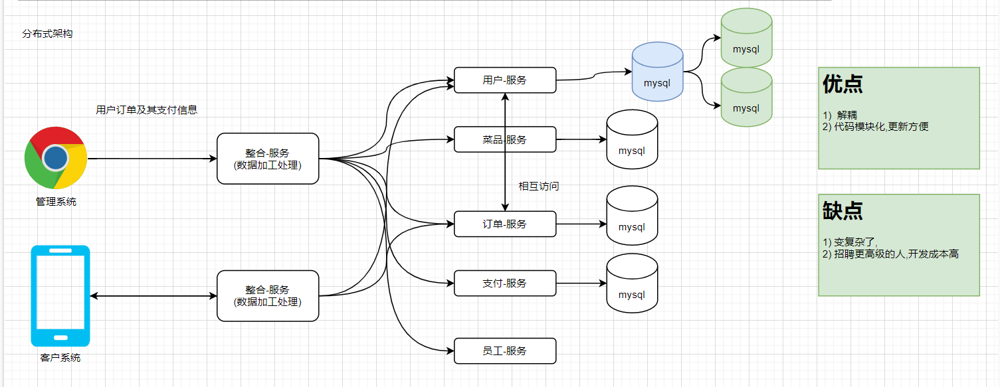
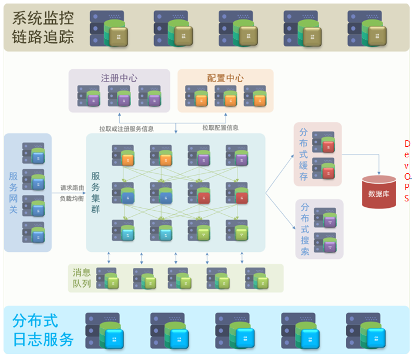
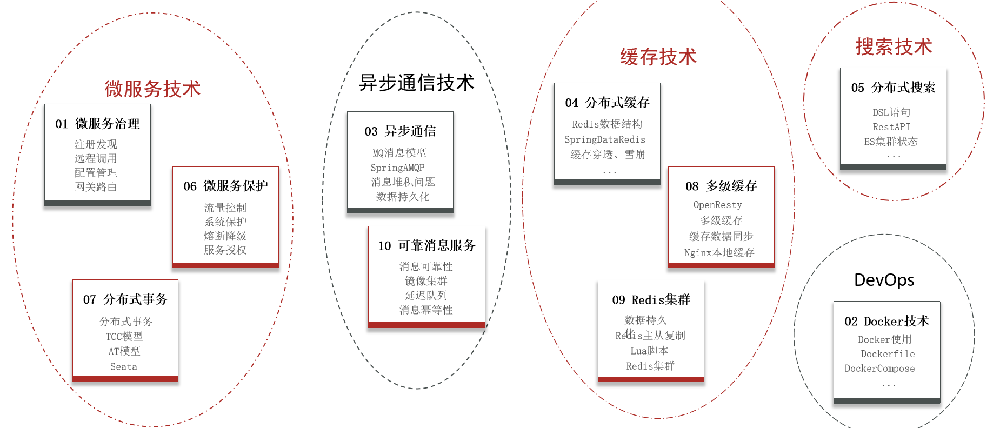
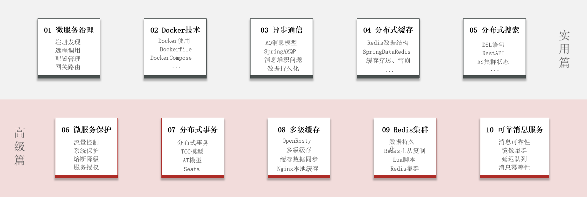
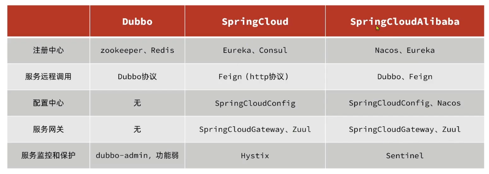
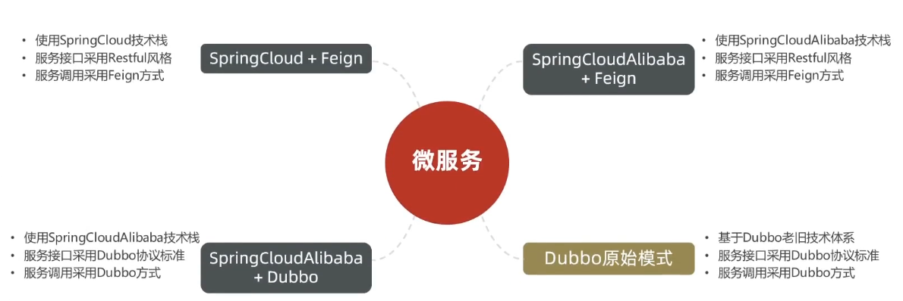
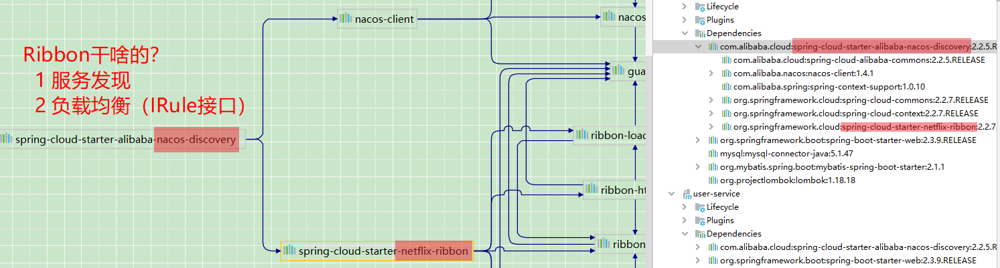

### 是啥？

> 分布式架构的最佳实践方案



### 学习啥？







### 技术对比



#### SpringCloud

> SpringCloud集成了各种微服务功能组件，并基于SpringBoot实现了这些组件的自动装配，从而提供了良好的开箱即用体验。
>
> SpringCloud依赖于SpringBoot，有版本的兼容关系。
>
> SpringCloud和Springboot的关系:
>
> 1 SpringCloud: 微服务管理和治理的技术集合
>
> 2 Springboot:  开发微服务

- 服务注册发现
  - Eureka
    网飞大作，Spring的默认实现
  - Nacos
    阿里大作，默认成功人士端口
  - Consul
  
- 服务远程调用
  - OpenFeign
  
    OpenFeign的前身是Feign，后者目前已经停更了，openFeign是SpringCloud在Feign的基础上支持了Spring MVC的注解，并通过动态代理的方式产生实现类来做负载均衡并进行调用其他服务。
  
  - Dubbo
    Apache Dubbo 是由阿里巴巴开源并捐赠给 Apache 的微服务开发框架，它提供了 RPC 通信与微服务治理两大关键能力。
  
- 服务链路监控
  - Zipkin
  - Sleuth
  
- 统一配置管理
  - SpringCloudConfig
  - Nacos
  
- 统一网关路由
  - SpringCloudGetway
  - Zuul
  
- 流控，降级，保护
  - Hystix
  - Sentinel


#### 几种常见的选型



------


### 拆分微服务

#### 0.0 原则

- 不同微服务，不要重复开发相同业务
- 微服务数据库独立，不要访问其它微服务的数据库
- 微服务可以将自己的业务暴露为接口，供其它微服务调用

#### 0.1 示例

cloud-demo：父工程，管理依赖

- order-service：订单微服务，负责订单相关业务
- user-service：用户微服务，负责用户相关业务

要求：

- 订单微服务和用户微服务都必须有各自的数据库，相互独立
- 订单服务和用户服务都对外暴露Restful的接口
- 订单服务如果需要查询用户信息，只能调用用户服务的Restful接口，不能查询用户数据库

-------


### 0 微服务技术

#### 0.0 注册发现

> 一个微服务，既可以是服务提供者，又可以是服务消费者，是相对而言的，
>
> A是B的服务消费者，B是A的服务提供者，B也可以是C的服务消费者，
>
> 正因如此Eureka将服务注册，服务发现等功能统一封装到了Eureka-client。

- A服务如何得知B服务的主机地址？
  - B服务实例启动后，将自己的信息**注册**到Eureka，这就是**服务注册**。
  - Eureka保存服务名称到服务实例地址的映射关系。
  - A根据服务名称，从Eureka拉取实例地址列表，这就是**服务发现**。

    > SpringCloud 使用Ribbon进行服务发现。
    > org.springframework.cloud.**netflix**.ribbon

- A服务如何从多个B服务中选择一个实例？
  - A服务从Eureka拉取实例地址列表，根据**负载均衡**算法选择一个实例地址。

    > SpringCloud用了Ribbon，根据service名称，获取到了包含所有服务实例的ip和端口的列表，根据负载均衡算法获得一个实例地址。
    >
    > SpringCloud Ribbon的底层采用了一个拦截器（LoadBalancerInterceptor），拦截了RestTemplate发出的请求，对地址做了修改。

- 无论服务注册采用网飞的Eureka实现还是阿里的Nacos，**服务发现都是网飞的Ribbon**
  

- A服务如何得知某个B服务是否健康，是否已经宕机？
  - B服务会每隔一段时间（默认30秒）向Eureka发送请求，报告自己的状态，称为心跳。
  - 当超过一定时间没有发送心跳时，Eureka认为微服务实例故障，从列表中删除。

- Nacos 和 Eureka 的却别
  

  Nacos的服务实例分为两种类型：

  - 临时实例（默认）：实例宕机超过一定时间，就会从服务列表剔除。
  - 非临时实例：实例宕机，不会从服务列表中剔除，也叫永久实例。

  Nacos和Eureka整体结构类似，比如服务注册、服务拉取（Ribbon）、都以发送心跳的方式做健康检测。

  Nacos与Eureka的区别

  - Nacos支持服务端主动检测提供者状态：临时实例采用心跳模式，非临时实例采用主动检测模式

  - 临时实例心跳不正常会被剔除，非临时实例则不会被剔除

  - Nacos支持服务列表变更的消息推送模式，服务列表更新更及时

  - Nacos、Eureka集群默认采用AP方式; 当集群中存在非临时实例时，采用CP模式；Eureka采用AP方式

    ```
    分布式架构：CAP定理（这3个要求无法同时满足）
    C:一致性，A：可用性，P：分区容错性
    ```


#### 0.1 远程调用

- RestTemplate 方式（SpringMVC的）

  ```java
  String url ="http://localhost:8081/user/"+order.getUserId();
  //方式一：将远程接口的返回的json格式的对象直接反序列化为指定类型的对象
  User user = restTemplate.getForObject(url, User.class);
  ```

  - 好处：简单
  - 坏处：硬编码，url参数复杂时难维护

- Feign（主流）
  Feign 底层依赖于 Ribbon 实现负载均衡和远程调用。

- Dubbo（阿里的）

#### 0.2 配置管理

- Spring Cloud Config（网飞的，依赖git）

- Apollo（携程开源）

- Nacos（阿里的，注册中心 + 配置中心）

  > Nacos一方面可以将配置集中管理，另一方可以在配置变更时，及时通知微服务，实现配置的热更新。

  - Feign底层发起http请求，依赖于其它的框架。其底层客户端实现包括：

    URLConnection：默认实现，JDK内置的。不支持连接池

    Apache HttpClient ：支持连接池

    OKHttp：支持连接池

    因此提高Feign的性能主要手段就是使用**连接池**代替默认的URLConnection。

#### 0.3 网关路由


> 网关用作：单一入口，路由
>
> 网关的核心功能：权限控制，限流，请求路由
>
> --------------------
>
> **路由和负载均衡**：一切请求都必须先经过gateway，但网关不处理业务，而是根据某种规则，把请求转发到某个微服务，这个过程叫做路由。当然路由的目标服务有多个时，还需要做负载均衡。
>
> **权限控制**：网关作为微服务入口，需要校验用户是是否有请求资格，如果没有则进行拦截。
>
> **限流**：当请求流量过高时，在网关中按照下流的微服务能够接受的速度来放行请求，避免服务压力过大。

- zuul（SpringCloud Netflix，旧的解决方案）Zuul是基于Servlet的实现，属于阻塞式编程。
- Getway（SpringCloud官方主流解决方案）基于Spring5中提供的WebFlux，属于响应式编程的实现，具备更好的性能。
- 