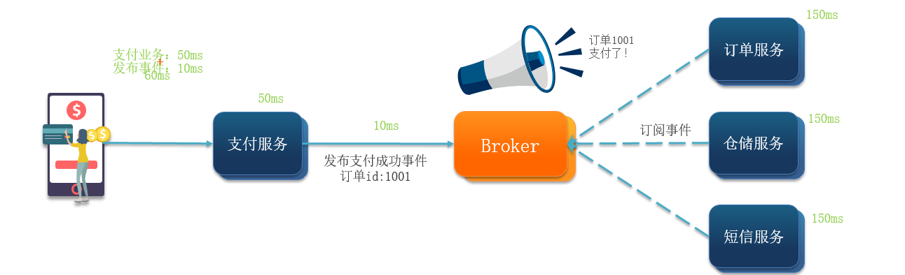
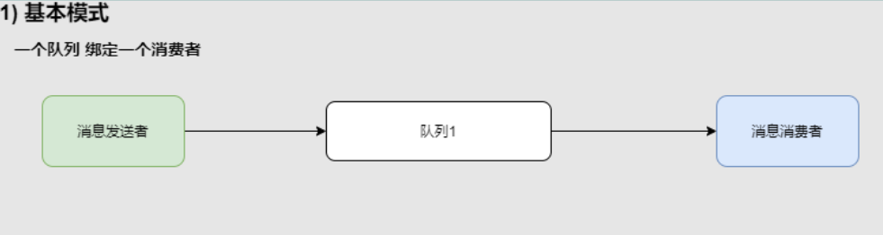
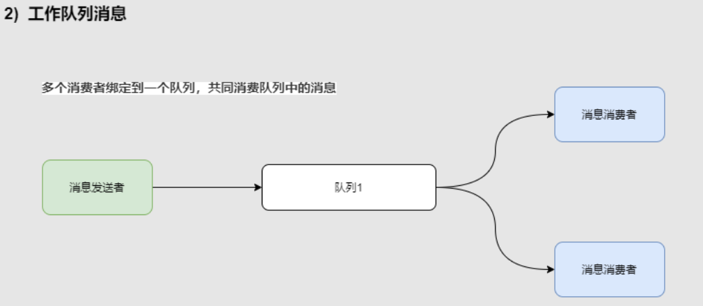
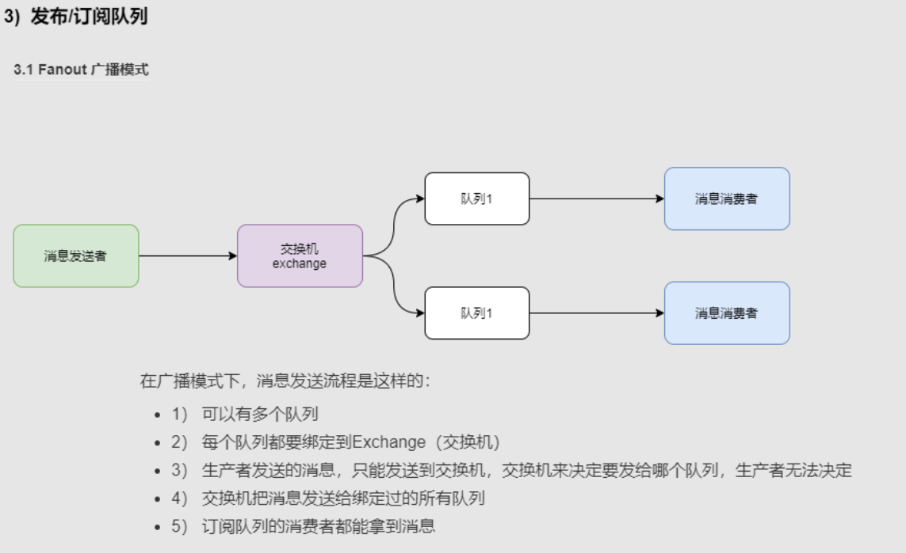
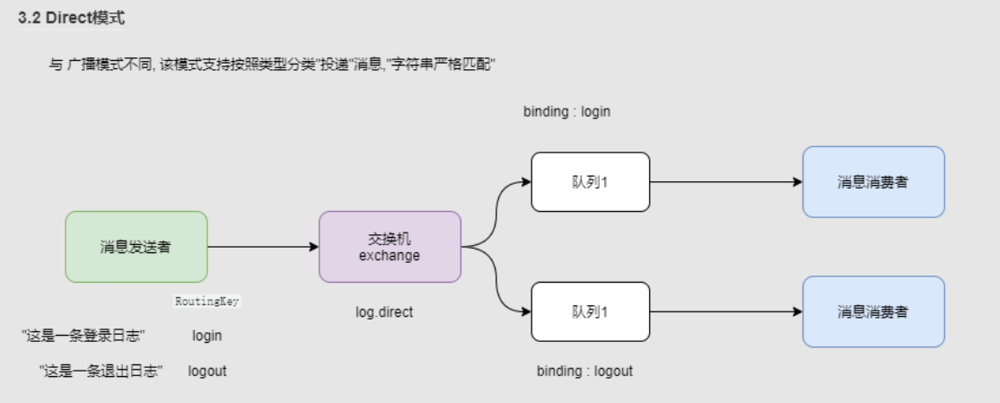
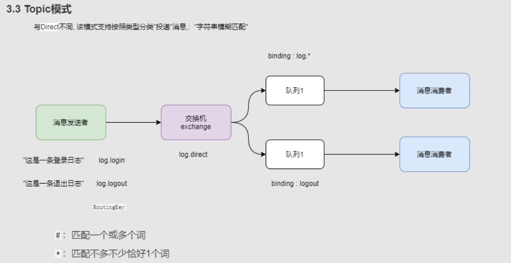
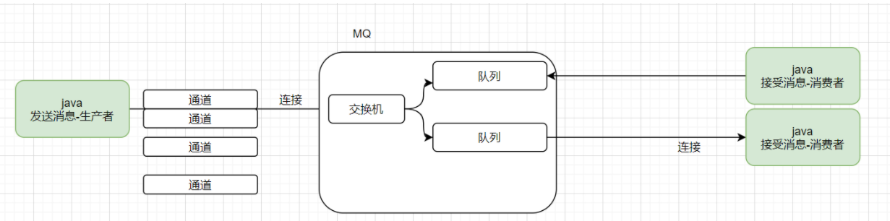

--------

### 消息队列

> 就是存放消息的队列(一种数据结构)

### 为啥需要消息队列？

1. 微服务通讯有同步和异步两种方式

   1. 同步通讯的缺点

      - 耦合严重，每次加入新的代码都需要修改原来的代码。
      - 性能问题，同步调用时，调用者需要等待服务提供者的响应，如果调用链很长，则响应给用户的时间就等于调用链的时间之和。
      - 资源浪费，在调用链中，调用在等待服务响应的过程中，整个调用链所占用的资源都不能被释放，高并发场景下会造成系统资源的浪费。
      - 级联失败，调用链中某个调用出现异常，会导致整个调用链出现问题，如同多米诺骨牌，会迅速导致整个微服务群故障。

   2. 同步通讯的优点

      - 时效性强，可以立即得到结果

   3. 异步通讯的缺点

      - 软件架构复杂度增加
      - Broker的安全性问题

   4. 异步通讯的优点
      

      > 可以避免同步通讯的缺点

      - 服务解耦

      - 性能提升，吞吐量高

      - 服务之间没有强依赖，不担心级联失败的问题

      - 流量削峰

        > 不管发布事件的流量波动多大，都由Broker接收，订阅者可以按照自己的速度去处理事件

        

### 技术对比

MQ，中文是消息队列（Message Queue），字面来看就是存放消息的队列。也就是事件驱动架构中的Broker。

比较常见的MQ实现：

- ActiveMQ
- RabbitMQ
- RocketMQ
- Kafka

几种常见MQ的对比：

| 对比       | **RabbitMQ**            | **ActiveMQ**                   | **RocketMQ** | **Kafka**  |
| ---------- | ----------------------- | ------------------------------ | ------------ | ---------- |
| 公司/社区  | Rabbit                  | Apache                         | 阿里         | Apache     |
| 开发语言   | Erlang                  | Java                           | Java         | Scala&Java |
| 协议支持   | AMQP，XMPP，SMTP，STOMP | OpenWire,STOMP，REST,XMPP,AMQP | 自定义协议   | 自定义协议 |
| 可用性     | 高                      | 一般                           | 高           | 高         |
| 单机吞吐量 | 一般                    | 差                             | 高           | 非常高     |
| 消息延迟   | 微秒级                  | 毫秒级                         | 毫秒级       | 毫秒以内   |
| 消息可靠性 | 高                      | 一般                           | 高           | 一般       |

追求可用性：Kafka、 RocketMQ 、RabbitMQ

追求可靠性：RabbitMQ、RocketMQ

追求吞吐能力：RocketMQ、Kafka

追求消息低延迟：RabbitMQ、Kafka

### RabbitMQ

#### RabbitMQ中的一些角色

- publisher：生产者
- consumer：消费者
- exchange：交换机，负责消息路由
- queue：队列，存储消息
- virtualHost：虚拟主机，隔离不同租户的exchange、queue、消息

#### 五个基本消息模型

1. 

2. Work queues，也被称为（Task queues），任务模型。

   当消息处理比较耗时的时候，可能**生产消息的速度会远远大于消息的消费速度**。长此以往，消息就会堆积越来越多，无法及时处理。

   此时就可以使用work 模型，**多个消费者共同处理消息处理**，速度就能大大提高了。

   - 问题
     - 消息是默认平均分配给每个消费者，并没有考虑到消费者的处理能力。
       可以通过修改配置（prefetch：预取）让消费者拿到一个消息后立即去获取下一个消息。

   

3. 可以看到，在订阅模型中，多了一个exchange角色，而且过程略有变化：

   - Publisher：生产者，也就是要发送消息的程序，但是不再发送到队列中，而是发给exchange（交换机）

   - Consumer：消费者，与以前一样，订阅队列，没有变化

   - Queue：消息队列也与以前一样，接收消息、缓存消息。

   - Exchange：交换机。一方面，接收生产者发送的消息。另一方面，知道如何处理消息，例如递交给某个特别队列、递交给所有队列、或将消息丢弃。到底如何操作，取决于Exchange的类型。

     Exchange有以下3种类型：

     - Fanout：广播，将消息交给所有绑定到交换机的队列
     - Direct：定向，把消息交给符合指定routing key 的队列
     - Topic：通配符，把消息交给符合routing pattern（路由模式） 的队列

   **Exchange（交换机）只负责转发消息，不具备存储消息的能力**，因此如果没有任何队列与Exchange绑定，或者没有符合路由规则的队列，那么消息会丢失！

   

   交换机的作用是什么？

   - 接收publisher发送的消息
   - 将消息按照规则路由到与之绑定的队列
   - 不能缓存消息，路由失败，消息丢失
   - FanoutExchange的会将消息路由到每个绑定的队列

   声明队列、交换机、绑定关系的Bean是什么？

   - Queue
   - FanoutExchange
   - Binding

4. 在Fanout模式中，一条消息，会被所有订阅的队列都消费。

   但是，在某些场景下，我们希望**不同的消息被不同的队列消费**。这时就要用到Direct类型的Exchange。


   

    在Direct模型下：

   - 队列与交换机的绑定，不能是任意绑定了，而是要指定一个`RoutingKey`（路由key）
   - 消息的发送方在 向 Exchange发送消息时，也必须指定消息的 `RoutingKey`。
   - Exchange不再把消息交给每一个绑定的队列，而是根据消息的`Routing Key`进行判断，只有队列的`Routingkey`与消息的 `Routing key`完全一致，才会接收到消息

   描述下Direct交换机与Fanout交换机的差异？

   - Fanout交换机将消息路由给每一个与之绑定的队列
   - Direct交换机根据RoutingKey判断路由给哪个队列
   - 如果多个队列具有相同的RoutingKey，则与Fanout功能类似

   基于@RabbitListener注解声明队列和交换机有哪些常见注解？

   - @Queue
   - @Exchange

5. `Topic`类型的`Exchange`与`Direct`相比，都是可以根据`RoutingKey`把消息路由到不同的队列。只不过`Topic`类型`Exchange`可以让队列在绑定`Routing key` 的时候**使用通配符！**

   `Routingkey` 一般都是有一个或多个单词组成，多个单词之间以”.”分割，例如： `item.insert`

    通配符规则：

   `#`：匹配一个或多个词

   `*`：匹配不多不少必须是1个词

   举例：

   `item.#`：能够匹配`item.spu.insert` 或者 `item.spu`

   `item.*`：只能匹配`item.spu`

   

   描述下Direct交换机与Topic交换机的差异？

   - Topic交换机接收的消息RoutingKey必须是多个单词，以 `**.**` 分割
   - Topic交换机与队列绑定时的bindingKey可以指定通配符
   - `#`：代表0个或多个词
   - `*`：代表1个词

------


#### publisher 流程



- 建立连接
  一个客户端和 MQ之间的一个网络连接
- 创建Channel
  一个连接可以有多个通道
  发送消息必须通过通道发送 (类似于河流上的小船)
- 声明队列
- 发送消息
- 关闭连接和channel

#### consumer 流程

- 建立连接
- 创建Channel
- **声明队列**
- 订阅消息

### SpringAMQP

> SpringAMQP是基于RabbitMQ封装的一套模板，并且利用SpringBoot对其实现了自动装配，使用起来非常方便。

SpringAMQP提供了三个功能：

- **自动声明队列**、交换机及其绑定关系

  ```java
  @Test
  @RabbitListener(queues = "test") // 消费者声明队列，生产者直接convertAndSend指定队列名称发送消息不用声明队列
  public void test1(String string){
  	System.out.println(string);
  }
  ```

- 封装了RabbitTemplate工具，用于发送消息 

- 基于注解的监听器模式，异步接收消息

### 消息转换器

Spring会把你发送的消息序列化为字节发送给MQ，接收消息的时候，还会把字节反序列化为Java对象。

但是，默认情况下Spring采用的序列化方式是JDK序列化。众所周知，JDK序列化存在下列问题：

- 数据体积过大
- 有安全漏洞
- 可读性差

可以配置jackson解决。