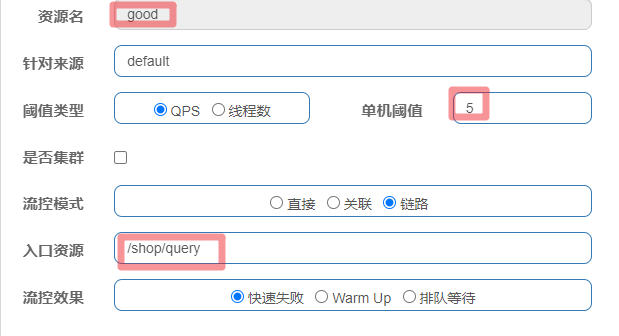
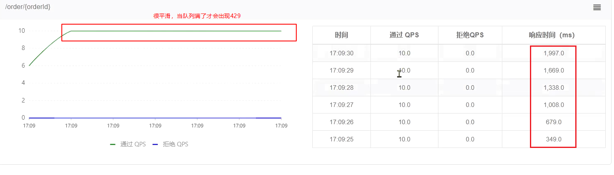
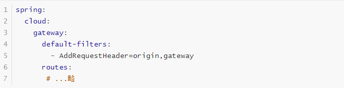
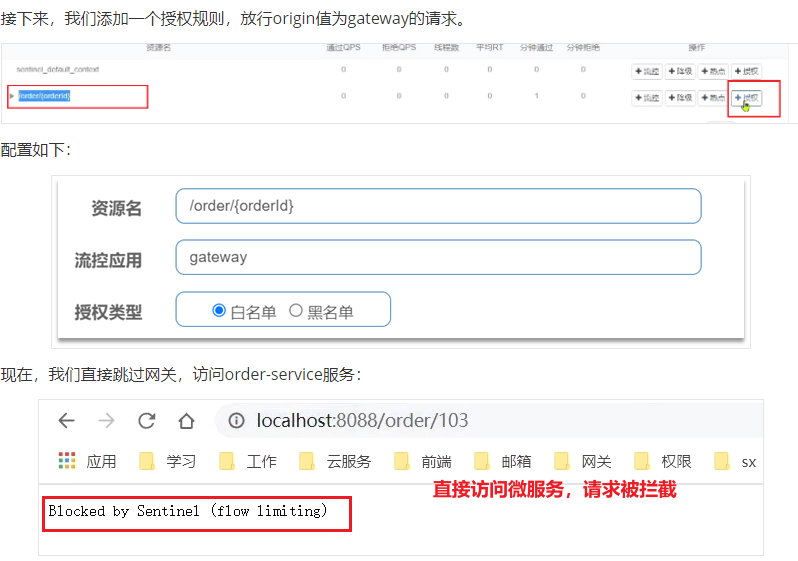

# 雪崩问题

- 分布式系统中的级联失败问题

## 解决方案

> 超时，线程隔离/舱壁模式，断路器：是在部分服务故障时，将故障控制在一定范围，避免雪崩。是一种**补救**措施。
>
> 限流：是对服务的保护，避免因瞬间高并发流量而导致服务故障，进而避免雪崩。是一种**预防**措施。

1. 设定超时时间，请求超过一定时间没有响应就返回错误信息，不会无休止等待
2. 限定每个业务能使用的线程数，避免耗尽整个tomcat的资源，因此也叫线程隔离
3. 由**断路器**统计业务执行的异常比例，如果超出阈值则会**熔断**该业务，拦截访问该业务的一切请求
4. 限制业务访问的QPS，避免服务因流量的突增而故障。

## 技术选型

1. 阿里巴巴，Sentinel
2. 网飞，Hystrix

|                | **Sentinel**                                   | **Hystrix**                   |
| -------------- | ---------------------------------------------- | ----------------------------- |
| 隔离策略       | 信号量隔离                                     | 线程池隔离/信号量隔离         |
| 熔断降级策略   | 基于慢调用比例或异常比例                       | 基于失败比率                  |
| 实时指标实现   | 滑动窗口                                       | 滑动窗口（基于 RxJava）       |
| 规则配置       | 支持多种数据源                                 | 支持多种数据源                |
| 扩展性         | 多个扩展点                                     | 插件的形式                    |
| 基于注解的支持 | 支持                                           | 支持                          |
| 限流           | 基于 QPS，支持基于调用关系的限流               | 有限的支持                    |
| 流量整形       | 支持慢启动、匀速排队模式                       | 不支持                        |
| 系统自适应保护 | 支持                                           | 不支持                        |
| 控制台         | 开箱即用，可配置规则、查看秒级监控、机器发现等 | 不完善                        |
| 常见框架的适配 | Servlet、Spring Cloud、Dubbo、gRPC  等         | Servlet、Spring Cloud Netflix |

>线程池隔离存在几个问题：
>
>1.线程池隔离使用会导致cpu上下文切换、内存增大等问题
>
>2.从tomcat线程转交任务到新的线程会导致threadlocal中存放的数据丢失

- 结论：Sentinel is nice ！


## Sentinel 中的流控设置

### 流控模式

1. 直接：默认模式，到达qps设置后，针对被流控的结点直接返回429.

2. 关联：假设有普通用户和vip用户接口，vip用户到达指定qps后，普通用户接口直接429.

3. 链路：阈值统计时，只统计从指定资源进入当前资源的请求，是对请求来源的限流

   ```java
   @RequestMapping("/shop")
   public class shop {
       @Autowired
       private goodService service;
   
       @GetMapping("/pay") // 保障支付接口的稳定
       public String pay(){
           return service.getGood(1);
       }
   
       @GetMapping("/query") // 对查询商品接口进行限制，到达qps直接429
       public String query(){
           return service.getGood(1);
       }
   
       @Service
       static class goodService{
           @SentinelResource("good")
           public String getGood(Integer id){
               return "good info : " + id;
           }
       }
   }
   ```

   

### 流控效果

1. fail-fast：默认的，直接429.

2. warm up：

   > 阈值一般是一个微服务能承担的最大QPS，但是一个服务刚刚启动时，一切资源尚未初始化（**冷启动**），如果直接将QPS跑到最大值，可能导致服务瞬间宕机。
   >
   > warm up也叫**预热模式**，是应对服务冷启动的一种方案。请求阈值初始值是 maxThreshold / coldFactor，持续指定时长后，逐渐提高到maxThreshold值。而coldFactor的默认值是3.
   >
   > 例如，我设置QPS的maxThreshold为10，预热时间为5秒，那么初始阈值就是 10 / 3 ，也就是3，然后在5秒后逐渐增长到10.
   > 
   >
   > 

3. 排队等待

   - 当请求超过QPS阈值时，快速失败和warm up 会拒绝新的请求并抛出异常。

   - 而排队等待则是让所有请求进入一个队列中，然后按照阈值允许的时间间隔依次执行。后来的请求必须等待前面执行完成，如果请求预期的等待时间超出最大时长，则会被拒绝。

     > 例如：QPS = 5，意味着每200ms处理一个队列中的请求；timeout = 2000，意味着**预期等待时长**超过2000ms的请求会被拒绝并抛出异常。 那什么叫做预期等待时长呢？
     >
     > > 比如现在一下子来了12 个请求，因为每200ms执行一个请求，那么：
     > >
     > > - 第6个请求的**预期等待时长** =  200 * （6 - 1） = 1000ms
     > > - 第12个请求的预期等待时长 = 200 * （12-1） = 2200ms

   

   

   


### 热点参数限流：略

## Sentinel中的隔离和降级

> 隔离和降级可以返回

### 线程隔离

线程隔离的两种手段是？

- 信号量隔离

- 线程池隔离

信号量隔离的特点是？

- 基于计数器模式，简单，开销小

线程池隔离的特点是？

- 基于线程池模式，有额外开销，但隔离控制更强

### 熔断降级


- closed：关闭状态，断路器放行所有请求，并开始统计异常比例、慢请求比例。超过阈值则切换到open状态
- open：打开状态，服务调用被**熔断**，访问被熔断服务的请求会被拒绝，快速失败，直接走降级逻辑。Open状态5秒后会进入half-open状态
- half-open：半开状态，放行一次请求，根据执行结果来判断接下来的操作。
  - 请求成功：则切换到closed状态
  - 请求失败：则切换到open状态

## Sentinel的授权规则

允许请求从gateway到order-service，不允许浏览器访问order-service，就可以使用授权规则。

在order-service中设置origin这个http请求头，给网关添加请求头




## Sentinel的自定义异常

默认情况下，发生限流、降级、授权拦截时，都会抛出异常到调用方。异常结果都是flow limmiting（限流）。这样不够友好，无法得知是限流还是降级还是授权拦截。

而如果要自定义异常时的返回结果，需要实现BlockExceptionHandler接口：

```java
public interface BlockExceptionHandler {
    /**
     * 处理请求被限流、降级、授权拦截时抛出的异常：BlockException
     */
    void handle(HttpServletRequest request, HttpServletResponse response, BlockException e) throws Exception;
}
```

这个方法有三个参数：

- HttpServletRequest request：request对象
- HttpServletResponse response：response对象
- BlockException e：被sentinel拦截时抛出的异常

这里的BlockException包含多个不同的子类：

| **异常**             | **说明**           |
| -------------------- | ------------------ |
| FlowException        | 限流异常           |
| ParamFlowException   | 热点参数限流的异常 |
| DegradeException     | 降级异常           |
| AuthorityException   | 授权规则异常       |
| SystemBlockException | 系统规则异常       |

```java
@Component
public class SentinelExceptionHandler implements BlockExceptionHandler {
    @Override
    public void handle(HttpServletRequest request, HttpServletResponse response, BlockException e) throws Exception {
        String msg = "未知异常";
        int status = 429;

        if (e instanceof FlowException) {
            msg = "请求被限流了";
        } else if (e instanceof ParamFlowException) {
            msg = "请求被热点参数限流";
        } else if (e instanceof DegradeException) {
            msg = "请求被降级了";
        } else if (e instanceof AuthorityException) {
            msg = "没有权限访问";
            status = 401;
        }

        response.setContentType("application/json;charset=utf-8");
        response.setStatus(status);
        response.getWriter().println("{\"msg\": " + msg + ", \"status\": " + status + "}");
    }
}
```

# END