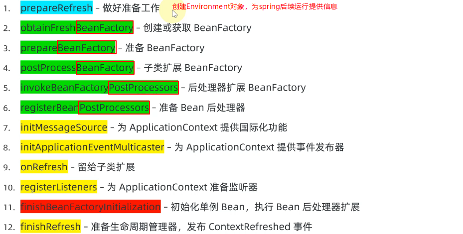
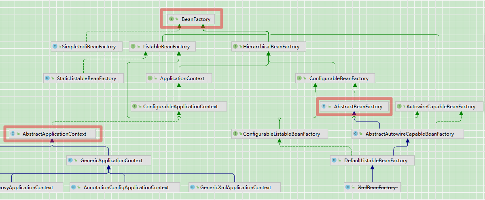

- [Aspect Orient Programming](https://docs.spring.io/spring-framework/docs/current/reference/html/core.html#aop-introduction-defn)

  > aop 是不是就是说：一堆注解+处理器
  >
  > Spring 默认是使用 jdk做代理，可以设置为cglib做代理。

  - AspectJ（编译器注入）是不是 Spring 的一个依赖 ？
    有人说spring不用AspectJ，只是Spring AOP使用了AspectJ的Annotation。使用了Aspect来定义切面,使用Pointcut来定义切入点，使用Advice来定义增强处理。虽然使用了Aspect的Annotation，但是并没有使用它的编译器和织入器。
    [Spring 2.0 解释与 AspectJ 5 相同的注释，使用 AspectJ 提供的库进行切入点解析和匹配。AOP 运行时仍然是纯 Spring AOP，并且不依赖于 AspectJ 编译器或编织器。](https://docs.spring.io/spring-framework/docs/2.5.x/reference/aop.html)
  - CGLIB（运行时生成）被用作在spring中创建非接口实现类的动态代理，jdk的动态代理只能为实现接口的类提供代理。
    cglib 据仓库描述已经不维护了，其在较新的jdk中可能不能正常工作，尤其是jdk17，推荐了个Byte Buddy，，，，，，
  - Spring AOP 是一个功能较弱的解决方案，AspectJ功能要强大一些，支持的pointtcut多一些，但使用后者需要学习新的语法，而前者是用Java的语法实现。AspectJ的学习推荐《AspectJ in Action》

- IOC

  - 一堆注解+反射

  - 依赖注入是IoC的一种方式。

    > 写php的framework的时候有写过依赖注入，分为构造函数的依赖注入，和方法参数的依赖注入，依赖注入这种操作强烈依赖反射的api。

- Spring

  - Spring 最初目标是代替 EJB 2 ，请记住 Spring 作者是在 J2ee development without EJB 一书的源代码基础上发展出 Spring 框架。

    https://www.amazon.com/Expert-One-One-Development-without/dp/0764558315

    书名是 Without **EJB**，不是 Without J2EE/Java EE 。

  - 引用

    > https://www.v2ex.com/t/290325
    > 如何看到甲骨文这个的行业毒瘤， JAVA EE 的未来会如何

- xml or annotation

  - [在实践中，有些人认为annotation很优雅，而他们认为 XML 冗长、丑陋且难以维护，而另一些人则认为annotation污染了 POJO 模型。](https://en.wikipedia.org/wiki/Plain_old_Java_object#cite_note-7)

# spring_refresh

## 12个阶段

### Envirment对象

### 获取BeanFactory

### 拓展BeanFactory

### 注册bean后处理器

### applicationContext各项功能

### 初始化单例，完成refresh

# spring_bean

## 主要方法

- AbstractBeanFactory 的 doGetBean 方法会在 refresh 的第11个阶段 finishBeanFactoryInitialization 的时候被调用。这个doGetBean就是bean的生命周期的体现。
- bean有不同的scop，不同scop的bean有不同的生命周期。