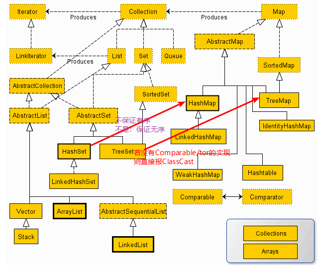

### TreeSet（rad black tree）

1. 能排序（compare返回负数往左放，返回正数往右放，0既重复）

### HashSet（1.7 or 1.8）

> ^ [Java遍历HashSet为什么输出是有序的？](https://www.zhihu.com/question/28414001)

1. Hash值是如何计算的？

   - 默认是根据地址值计算的

2. 是否可是重写HashCode方法，给对象一个自增的ID，重写hashCode方法，用ID算出hash返回，是不是可以实现HashSet的排序？

   - 不可以，hash算法细节

3. 采用HashMap实现

4. 不保证有序，

   ```java
   class Test{
       public int id;
       public Test(int id) {
           this.id = id;
       }
       @Override
       public String toString() {
           return "Test{" +
                   "id=" + id +
                   '}';
       }
   }
   ```

   当数据量小的时候：容易误以为是倒叙。

   ```java
   HashSet<Test> hashSet = new HashSet<>();
   for (int i = 0; i < 2; i++) {
       hashSet.add(new Test(i));
   }
   System.out.println(hashSet);
   // out: [Test{id=1}, Test{id=0}]
   ```

   增加数据量：无序出现了。

   ```java
   hSet<Test> hashSet = new HashSet<>();
   for (int i = 0; i < 10; i++) {
       hashSet.add(new Test(i));
   }
   System.out.println(hashSet);
   // out：[Test{id=1}, Test{id=3}, Test{id=6}, Test{id=0}, Test{id=8}, Test{id=5}, Test{id=7}, Test{id=2}, Test{id=4}, Test{id=9}]
   ```

   HashSet不保证有序**不是保证无序**: 像下面这种情况容易误认为HashSet是有序的。

   > HashSet的是Integer，其hashCode()实现就返回int值本身。所以在对象hashCode这一步引入了巧合的“按大小排序”。
   > 在非Integer时HashMap.hash(Object)获取了对象的hashCode()之后会尝试进一步混淆。

   ```java
   HashSet<Integer> bigSet = new HashSet<>();
   for (int i = 0; i < 10000; i++) {
       bigSet.add(i);
   }
   System.out.println(bigSet);
   // out: [0, 1, 2, 3, 4, 5, 6, 7, 8, 9, ......]
   ```

