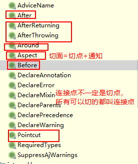

- 连接点（JoinPoint）：正在执行的方法，例如：update()、delete()、select()等都是连接点。
- 切入点（Pointcut）：进行功能增强了的方法，例如:update()、delete()方法，select()方法没有被增强所以不是切入点，但是是连接点。
  - 在SpringAOP中，一个切入点可以只描述一个具体方法，也可以匹配多个方法
    - 一个具体方法：com.itheima.dao包下的BookDao接口中的无形参无返回值的save方法
    - 匹配多个方法：所有的save方法，所有的get开头的方法，所有以Dao结尾的接口中的任意方法，所有带有一个参数的方法
- 通知（Advice）：在切入点前后执行的操作，也就是增强的共性功能
  - 在SpringAOP中，功能最终以方法的形式呈现
- 通知类：通知方法所在的类叫做通知类
- 切面（Aspect）：描述通知与切入点的对应关系，也就是哪些通知方法对应哪些切入点方法。

通知获取数据:
1.获取切入点方法的参数:
JoinPoint:用于前置 后置 返回后 抛出异常后通知,设置为方法的第一个形参
ProceedJointPoint:用于环绕通知

2.获取切入点方法返回值:
(正常执行 才能 拿到  )
返回后通知
环绕通知

3.获取切入点方法运行异常信息:
抛出异常后通知
环绕通知