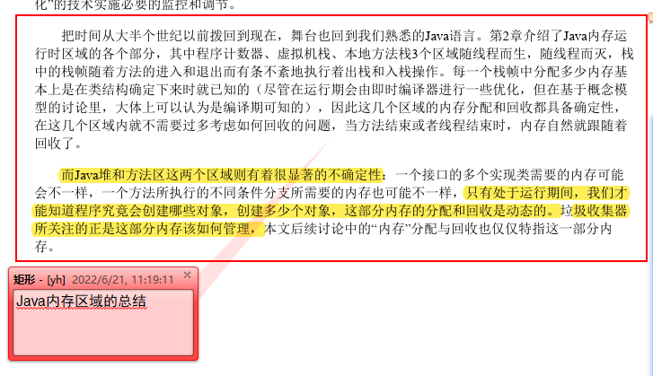
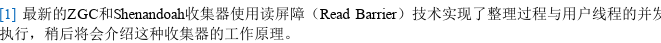
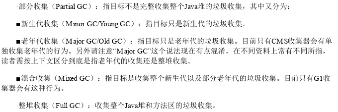
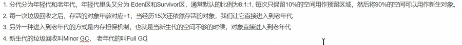
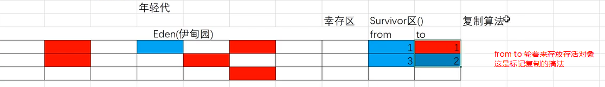

[《深入理解 Java 虚拟机》阅读笔记](https://github.com/TangBean/understanding-the-jvm)

[Java 虚拟机底层原理知识总结](https://github.com/doocs/jvm)

# 第三版大纲

1. 走进java，java和虚拟机历史，展望未来，手动编译jdk
2. 自动内存管理
   1. - [ ] Java内存模型详解,
   2. - [ ] 垃圾收集器，内存分配策略,
   3. 性能监控工具，故障处理工具
   4. 性能调优案例与实战
3. 虚拟机执行子系统
   1. - [ ] 类文件结构，
   2. - [ ] 虚拟机类加载机制,
   3. - [ ] 虚拟机字节码引擎,
   4. 类加载与执行子系统的实战
4. 程序编译与代码优化
   1. 前后端编译与优化
   2. 高效并发
   3. 线程安全与锁优化

# 备注

垃圾收集三问

- 那些内存需要回收（堆和方法区）
  - 

- 啥时候回收（可达性分析）
  - 如何判断对象不可能再通过任何途径被使用了
    - 引用计数，一个数字记录对象的引用，引用加一，取消引用减一
      - 简单
      - 有循环引用的问题
    - 可达性分析
      - 主流，妙的很
- 如何回收（各种算法）
  - 标记清除
    - 内存不连续
      - 标记的效率不高
      - 清除的效率也不高
  - 标记复制
    - 浪费一半内存
    - 98% 理论
  - 标记整理（）
    - 需要移动对象
    - 如果再老年代这种有大量存活对象的区域，移动存活对象，并更新对他们的引用消耗大；
    - 对象移动操作必须暂停用户程序才可以，
      
  - 分代
    - 分代好啊~~~~~

> 回收类型，垃圾收集算法，垃圾收集器
> 
>
> 年轻代STW？why，，，啥收集器使用啥算法会STW，
>
> 年轻代每次gc幸存的对象少，符合98理论，所以标记复制算法，从伊甸园到from，经过多次幸存后到to，再到老年代
>
> 老年代幸存率高，而且没有内存担保，所以要标记清除或整理。？？标记整理，，清除把，移动存活对象消耗不大嘛？
>
> 
>
> 分代收集中两个幸存区，为啥需要两个？标记复制需要
>
> 

