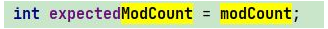

## !!

[评论有个ArrayList中的Iterator的简单实现。注意modCount作用](https://www.nowcoder.com/questionTerminal/95e4f9fa513c4ef5bd6344cc3819d3f7)

## 一：快速失败（fail—fast）

​     在用迭代器遍历一个集合对象时，如果遍历过程中对集合对象的结构进行了修改（增加、删除），则会抛出Concurrent Modification Exception。

​     原理：迭代器在遍历时直接访问集合中的内容，并且在遍历过程中使用一个 modCount 变量。集合在被遍历期间如果结构发生变化，就会改变modCount的值。每当迭代器使用hashNext()/next()遍历下一个元素之前，都会检测modCount变量是否为expectedmodCount值，是的话就返回遍历；否则抛出异常，终止遍历。

   注意：这里异常的抛出条件是检测到 modCount！=expectedmodCount 这个条件。如果集合发生变化时修改modCount值刚好又设置为了expectedmodCount值，则异常不会抛出。因此，不能依赖于这个异常是否抛出而进行并发操作的编程，这个异常只建议用于检测并发修改的bug。

   场景：java.util包下的集合类都是快速失败的，不能在多线程下发生并发修改（迭代过程中被修改）。

----------------

- java.util下的类调用iterator方法的时候会记录一个modCount值。

  

- 集合在被遍历期间如果结构发生变化（增删操作），就会改变modCount的值。
  每当迭代器使用hashNext()/ next()遍历下一个元素之前，都会检测modCount变量是否为expectedmodCount值，是的话就返回遍历；否则抛出异常，终止遍历。

```java
import java.util.ConcurrentModificationException;
import java.util.Iterator;

class myArrList {
    public int[] arr = new int[10];
    int index = -1;
    int modCount = 0;
    // add
    public void add(int num){
        modCount++;
        this.index++;
        arr[this.index]=num;
    }
    // delete
    public int delete(int index){
        modCount++;
        if (index<0) return 0;
        int foo = arr[index];
        arr[index] = 0;
        this.index--;
        return foo;
    }
    public Iterator getit(){
        return new it();
    }
    class it implements Iterator{
        int expectedModCount = modCount;
        int i = index;
        @Override
        public boolean hasNext() {
            if (expectedModCount!=modCount)throw new ConcurrentModificationException();
            return i>-1;
        }
        @Override
        public Object next() {
            if (expectedModCount!=modCount)throw new ConcurrentModificationException();
            return arr[i--]; // ,,,倒序输出，，，菜
        }
    }
}
class test{
    public static void main(String[] args) {
        myArrList a = new myArrList();
        a.add(1);
        a.add(2);
        a.add(3);
        // System.out.println(Arrays.toString(a.arr));

        Iterator i = a.getit();
        a.add(2); // 导致！=成立，抛出异常
        while (i.hasNext()){
            System.out.println(i.next());
        }
    }
}
```


## 二：安全失败（fail—safe）

   采用安全失败机制的集合容器，在遍历时不是直接在集合内容上访问的，而是先复制原有集合内容，在拷贝的集合上进行遍历。

   原理：由于迭代时是对原集合的拷贝进行遍历，所以在遍历过程中对原集合所作的修改并不能被迭代器检测到，所以不会触发Concurrent Modification Exception。

   缺点：基于拷贝内容的优点是避免了Concurrent Modification Exception，但同样地，迭代器并不能访问到修改后的内容，即：迭代器遍历的是开始遍历那一刻拿到的集合拷贝，在遍历期间原集合发生的修改迭代器是不知道的。

​     场景：java.util.concurrent包下的容器都是安全失败，可以在多线程下并发使用，并发修改。