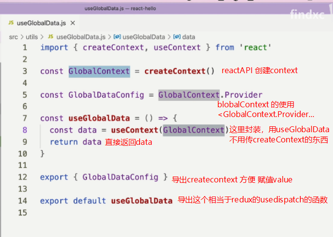

[使用Context处理React全局共享数据](https://juejin.cn/post/6884801072821927944)

~~~
Context使用回顾
通过Context修改全局数据
Context都传递下去的问题
将Context存储的数据抽离出来
配合Reducer使用
~~~

[context 在 react-redux 库中的应用](https://www.bilibili.com/video/BV1Mf4y1V7W3?spm_id_from=333.999.0.0)

~~~
这个整挺好，还有redux源码，还有context，
~~~

# 使用context

~~~react
import {createContext, useState} from "react";
import Child1 from "./Child1";
// 调用reactAPI创建context
let Context = createContext(1);
function App(){
    // 调用useState创建状态
    let [v, setV] = useState(2);
    return(
        // 使用Provider，赋值value
        <Context.Provider value={v}>
            <button onClick={()=>{
                setV(v+1); // 改变状态
            }}>this is app</button>
            
            <Child1 con={Context}/> {/*传递context*/}
        </Context.Provider>
    );
}
export default App;
~~~

~~~react
import {useContext} from "react";

export default function Child1({con}){
    return <Child2 con={con}/>;
}

function Child2({con}){
    let context = useContext(con);
    let button = <button>{context}</button>;
    return button;
}
~~~

