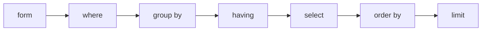

```mysql
SELECT selection_list /*要查询的列名称*/
​	FROM table_list /*要查询的表名称*/
​	WHERE condition /*行条件*/
​	GROUP BY grouping_columns /*对结果分组*/
​	HAVING condition /*分组后的行条件*/
​	ORDER BY sorting_columns /*对结果排序*/
​	LIMIT offset_start, row_count /*结果限定*/
```

>查询语句书写顺序


>查询语句执行顺序



- WHERE

  ```mysql
  =、!=、<>、<、<=、>、>=
  BETWEEN…AND
  IN(set)
  IS NULL  
  AND
  OR
  NOT
  ```

- LIKE

  ```mysql
  _: 任意一个字母
  %：任意0~n个字母
  ```

- 聚合函数

  ```
  COUNT()：统计指定列不为NULL的记录行数
  MAX()：计算指定列的最大值，如果指定列是字符串类型，那么使用字符串排序运算
  MIN()：计算指定列的最小值，如果指定列是字符串类型，那么使用字符串排序运算
  SUM()：计算指定列的数值和，如果指定列类型不是数值类型，那么计算结果为0
  AVG()：计算指定列的平均值，如果指定列类型不是数值类型，那么计算结果为0
  ```

  

