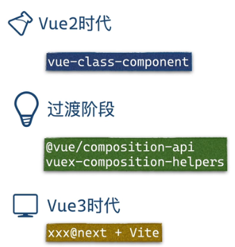
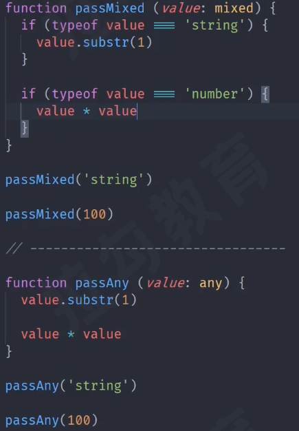

#### [【2021年5月更新】Vue3+TypeScript从入门到实战全系列教程](https://www.bilibili.com/video/BV1gf4y1W783?from=search&seid=7092774578790706426&spm_id_from=333.337.0.0)

##### P1:

- Vue + TS 历史变革
  

- vite 还是 webpack
  - vite 用 es6 == 快；
  - 不考虑浏览器兼容 直接上vite，webpack 对浏览器版本兼容好；
  - 其实 vite 跟 webpack 提供的功能也不非常一致；
  - 故，，，能跑就行；


#### [【阿里P7大神强推】2021前端 TypeScript 快速上手,从入门到精通全集](https://www.bilibili.com/video/BV1784y1c7V9?p=2&spm_id_from=pageDriver)

- 强类型 pk 弱类型（各种隐式类型转换），静态类型 pk 动态类型（没有语言层面的类型检查），js的类型问题（弱类型+动态类型）；

- flow方案（code阶段做静态类型检查的工具）或者用 bable套装；

- flow 的 mixed & any
  **相同**：mixed 跟 any 都接收任意类型
  **不同**：mixed 还是强类型，要使用传统 typeof 进行类型判断后flow才不会报错；any相当于没用 flow 的原始 js 的弱类型，并且不会被flow报错，any 的存在可以用来兼容以前的老代码；
  

- up主推荐的 flow 第三方类型手册：https://www.saltycrane.com/cheat-sheets/flow-type/latest/

- Ts pk js+flow

  - Ts 的类型检查是被code内置的 == “不卡”，code+flow插件是相对“卡”的；
  - Ts 支持 ecma 的最新标准，并且完全兼容原生js语法，故即使不用Ts的类型系统，也可以使用Ts所支持的 ecma 语法，支持 ecma 最新语法也是 Ts 的主要功能之一；

- Ts 配置文件：tsconfig.json，可以用 yarn 初始化配置文件

  - 亮点："strict": true，可以一键开启严格模式，，，实在是妙；

- Primitive Types

  - 跟 js 原始类型是有差异的；
  - strict模式下 与 非strict模式下类型系统对相同的类型有不同反应；

- ecma2015 的 Symbol 类型需要改配置文件使用 "target": "ES2015" , ta 会引入2015的标准库；
  或者 "lib": ["ES2015"] 引入标准库，使用lib会覆盖默认的标准库，如“DOM”(TS的DOM=BOM+DOM)，，导致需要用啥引入啥；

- Ts 支持中文错误消息，该配置文件可以实现，但是复杂错误用中文不方便google；

- Ts 作用域

  - 不同文件有相同变量名会报重复定义的错误

    ```typescript
    // 立即执行函数 创建 单独作用域
    (function () {
        const a = foo;
    })
    // 使用 esmodule，模块导出会有单独的作用域
    export {}
    ```

- 类型

  - object: 泛指所有非原始类型（{} [] function / 对象 数组 函数）

  - 单纯的对象类型

    ```typescript
    const obj01: { foo: number, bar: string } = { foo: 123, bar: 'string...'}
    ```

  - 数组

    ```typescript
    const arr1: Array<number> = [1,2,3]
    const arr2: number[] = [1,2,3]
    function sum(...args: number[]){
        return args.reduce((prev, current)=>prev+current, 0)
    }
    ```

    

-----------

- v8 的日志分析工具页面采用 grid 布局
  https://v8.github.io/tools/head/system-analyzer/index.html

- 关于 jsmodule
  https://developer.mozilla.org/zh-CN/docs/Web/JavaScript/Guide/Modules
  mdn module 演示仓库 https://github.com/mdn/js-examples

  - ts 不支持 .mjs 模块js后缀名

-  重新介绍 JavaScript（**JS 教程**）（有闭包的解释）
  https://developer.mozilla.org/zh-CN/docs/Web/JavaScript/A_re-introduction_to_JavaScript
  闭包 Closures
  https://developer.mozilla.org/zh-CN/docs/Web/JavaScript/Closures

- js 的 OOP

  类（ES6 的东西）
  https://developer.mozilla.org/zh-CN/docs/Web/JavaScript/Reference/Classes 
  https://zh.javascript.info/class

  继承 与 原型链
  https://developer.mozilla.org/zh-CN/docs/Web/JavaScript/Inheritance_and_the_prototype_chain
  https://zh.javascript.info/prototype-inheritance

