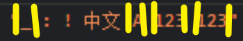

> reg 字符串 = 模式匹配的模式串；
>
> Patterns 模式，flags 修饰符，Anchors 锚点;
>
> 有的地方把 flags 翻译为修饰符，有的地方翻译为标志，s则翻译为特殊标志，在这里统一为修饰符与特殊修饰符；
>
> ------
>
> 采用以下书写格式
>
> - 标题，注释.....
>   用于.....
>
>   ```js
>   实例代码
>   ```

1. #### / Patterns / [ flags: [g i m u y]() ~ 鸡唛 ]

- 常用修饰符 (flags) 不包括特殊修饰符
  i：不区分大小写；
  u：开启完整的 unicode 支持；
  g：搜索时会查找所有的匹配项，而不只是第一个；
  m：多行模式；y：粘滞模式；
- 
  如果不使用修饰符和特殊修饰符，正则表达式的搜索就等同于子字符串查找。
- `str.search(regexp)` 方法返回的是找到的匹配项的索引位置，如果没找到则返回 `-1`。
  str.match(/regexp/) 方法返回的是查找到的子字符串。
  /regexp/.test("...") 方法返回的是Boolean；

2. #### / Patterns: [\d \s \w \D \S \W .]() / [ flags: [s]() ]

- **Character classes**

  模式串中的字符类

  | 字符类           | 含义                                                         | 备注  |
  | ---------------- | ------------------------------------------------------------ | ----- |
  | \d，数字         | 从 `0` 到 `9` 的字符                                         | digit |
  | \s，空格或\n\t等 | 包括空格，制表符 `\t`，换行符 `\n` 和其他少数稀有字符，例如 `\v`，`\f` 和 `\r` | space |
  | \w，单字字符     | 拉丁字母或数字或下划线 `_`。非拉丁字母（如西里尔字母或印地文）不属于 `\w` | word  |

- **字符类的反向类**，形式上是用大写字母表示的字符类；
  用于匹配除对应小写字母所匹配的字符之外的所有字符；

  ```js
  let str = "+7(903)-123-45-67";
  alert( str.match(/\d/g).join('') ); // 79031234567
  alert( str.replace(/\D/g, "") ); // 79031234567
  ```

- **特殊字符类 Dot**
  用于匹配 “除换行符之外的任何单个字符”；

  ```js
  alert( "Z".match(/./) ); // Z
  
  let regexp = /CS.4/;
  alert( "CSS4".match(regexp) ); // CSS4
  alert( "CS-4".match(regexp) ); // CS-4
  alert( "CS 4".match(regexp) ); // CS 4 (space is also a character)
  ```

- **特殊修饰符 s**
  用于使特殊字符类 Dot 的匹配包括换行符\n，既匹配任何单个字符；

  ```js
  alert( "A\nB".match(/A.B/) ); // null (no match)
  alert( "A\nB".match(/A.B/s) ); // A\nB (match!)
  // [\s\S]/[\d\D]... 有相同作用，或者使用 [^] 意思是匹配任何字符，除了什么都没有；
  alert( "A\nB".match(/A[\s\S]B/) ); // A\nB (match!)
  ```

3. #### / Patterns: [\p{...}]() / [ flags: [u]() ]

- **u**，既Unicode首字母；

  js 由于[历史局限性](https://zh.javascript.info/regexp-unicode#unicode-shu-xing-unicodepropertiesp)会把一个 4 个字节的“长字符”当成一对 2 个字节长的字符；

  当一个正则表达式使用**修饰符u**后，4 个字节长的字符将被正确地处理：被看成单个的字符，而不是 2 个 2 字节长的字符；

- Unicode 属性
  Unicode 中的每一个字符都具有很多的属性。它们描述了一个字符属于哪个“类别”，包含了各种关于字符的信息。

  例如，如果一个字符具有 `Letter` 属性，这意味着这个字符归属于（任意语言的）一个字母表。而 `Number` 属性则表示这是一个数字：也许是阿拉伯语，亦或者是中文，等等。

- **/ \p{L} /gu**，查找字母(所有语言的)
  L 是 Letter(字母) 的缩写，Unicode属性们几乎都有缩写；
  为了使用**\p{...}**必须使用**修饰符u**；

  ```js
  let str = "A ბ ㄱ";
  
  alert( str.match(/\p{L}/gu) ); // A,ბ,ㄱ
  alert( str.match(/\p{L}/g) ); // null（没有匹配的文本，因为没有修饰符“u”）
  ```

- **\p{Hex_Digit}**，查找16进制数字

  查找 16 进制数字，写作 **xFF** 其中 `F` 是一个 16 进制的数字（0…9 或者 A…F）。

  一个 16 进制数字可以表示为 **\p{Hex_Digit}**：

  ```js
  let regexp = /x\p{Hex_Digit}\p{Hex_Digit}/u;
  alert("number: xAF".match(regexp)); // xAF
  ```

- **\p{sc=Han}**，查找中文字符

  unicode 属性 `Script` （书写系统），这个属性可以有一个值：`Cyrillic`，`Greek`，`Arabic`，`Han` （中文）等等，[这里是一个完整的列表](https://en.wikipedia.org/wiki/Script_(Unicode))。

  为了实现查找一个给定的书写系统中的字符，我们需要使用 `Script=<value>`，例如对于中文字符：**\p{sc=Han}**。

  ```js
  let regexp = /\p{sc=Han}/gu; // returns Chinese hieroglyphs（象形文字）
  let str = `Hello Привет 你好 123_456`;
  alert( str.match(regexp) ); // 你,好
  ```

- **\p{Sc}**，查找货币符号
  表示货币的字符，例如 `$`，`€`，`¥`，具有 unicode 属性 **\p{Currency_Symbol}**，缩写为 **\p{Sc}**；

  ```js
  let regexp = /\p{Sc}\d/gu;
  let  str = `Prices: $2, €1, ¥9`;
  alert( str.match(regexp) ); // $2,€1,¥9
  ```

4. #### / Anchors: [^ $]() / [ flags: [m]() ]

- **^ $** 单独用

```js
let str1 = "Mary had a little lamb";
alert( /^Mary/.test(str1) ); // true

let str1 = "it's fleece was white as snow";
alert( /snow$/.test(str1) ); // true
```

- **^ $** 组合用

```
let goodInput = "12:34";
let badInput = "12:345";

let regexp = /^\d\d:\d\d$/;
alert( regexp.test(goodInput) ); // true
alert( regexp.test(badInput) ); // false
```

- 什么字符串可以匹配模式 `^$`？唯一一个匹配的字符串是空字符串：它的开始紧跟着结束

- **修饰符 m**
  开启锚点匹配的多行模式，仅仅影响 **^ $** 的行为

  ```js
  let str = `1st place: Winnie
  2nd place: Piglet
  33rd place: Eeyore`;
  
  str.match(/^\d/m); // ['1']
  str.match(/^\d/mg); // (3) ['1', '2', '3']
  str.match(/^\d+/mg); // (3) ['1', '2', '33']
  
  str.match(/\w$/m); // ['e']
  str.match(/\w$/mg); // (3) ['e', 't', 'e']
  str.match(/\w+$/mg); // (3) ['Winnie', 'Piglet', 'Eeyore']
  ```

- TODO : ^$ 与 \n 匹配一行 balabala

5. #### 词边界 \b

   何处有边界？单词前后，数字前后；
   借助 `/\bHello\b/` 理解边界：词边界测试 `\b` 检查位置的一侧是否匹配 `\w`，而另一侧则不匹配 “`\w`”。但是，`\w` 表示拉丁字母 `a-z`（或数字或下划线），因此此检查不适用于其他字符，如西里尔字母（cyrillic letters）或象形文字（hieroglyphs）。

   ```js
   let foo = "_ : ! 中文 A 123 123"; // 数字,字母,下划线 的附近有边界 
   foo.match(/\b\s\b/g); // (2) [' ', ' '] ，如图黄色边界所示，这两个空格是"A空格123空格123"中的；
   ```

   

6. #### 集合

   ```js
   // 查找 [t 或者 m]，然后再匹配 “op”
   alert( "Mop top".match(/[tm]op/gi) ); // "Mop", "top"
   ```

   - 可以使用Unicode属性编写集合
     

7. #### 范围

   **[0-9]** —— 和 `\d` 相同，

   **[a-zA-Z0-9_]** —— 和 `\w` 相同，

   **[\t\n\v\f\r ]外加少量罕见的 unicode 空格字符** —— 和 `\s` 相同。

   

