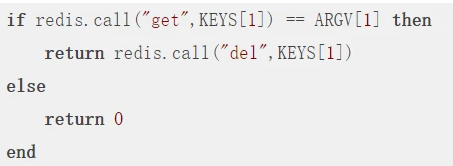
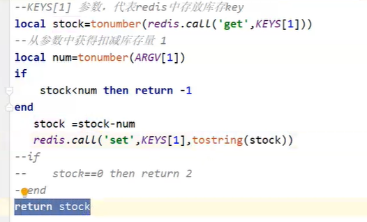

### 分布式锁

- 两个服务A,B; 通过Nginx做负载均衡到服务, 两个服务对临界资源进行操作的时候会出现并发问题;
- 所以通过引入Redis做分布式锁;

### V1: 通过 Redis 做分布式锁

```mermaid
sequenceDiagram
    autonumber
    服务A ->> redis : setnx lock 1
    %% 这里是一个注释代码
    rect rgba(0,255,255,.1)
        loop 线程中循环等待锁资源释放
            服务B ->> +redis : setnx lock 1
            redis ->> -服务B : "0"
            Note over redis,服务B : 循环获取锁
        end
    end
    服务A ->> mysql : 访问临界资源
    服务A ->> redis : delete lock
    服务B ->> mysql : 访问临界资源
    服务B ->> redis : delete lock
```


- 存在的问题
  - 假设服务A在阶段4发生了异常, 程序炸了, 那锁就得不到释放, 就锁死了;
- 解决方案
  - 增加key的过期时间

### V2: 增加key的过期时间

```mermaid
sequenceDiagram
	autonumber
    服务A ->> redis : setnx lock 1
    Note over 服务A,redis: 增加key的过期时间
    rect rgba(0,255,255,.1)
        loop 线程中循环等待锁资源释放
            服务B ->> +redis : setnx lock 1
            Note over 服务B,redis: 增加key的过期时间
            redis ->> -服务B : "0"
            Note over redis,服务B : 循环获取锁
        end
    end
    服务A ->> mysql : 访问临界资源
    Note over 服务A: 发生了异常,服务炸了
    Note over redis: 超时自动解锁
    服务B ->> mysql : 访问临界资源
    服务B ->> redis : delete lock
```

- 存在的问题

  - 会把别人的锁释放掉

    ```mermaid
    sequenceDiagram
    	autonumber
        服务A ->> redis : setnx lock 1
        Note over 服务A,redis: 增加key的过期时间
        rect rgba(0,255,255,.1)
            loop 线程中循环等待锁资源释放
                服务B ->> +redis : setnx lock 1
                Note over 服务B,redis: 增加key的过期时间
                redis ->> -服务B : "0"
                Note over redis,服务B : 循环获取锁
            end
        end
        服务A ->> mysql : 访问临界资源
        Note over 服务A: 有个啥玩意执行时间超长<br/>超过了key的过期时间
        Note over redis: 超时自动解锁
        服务B ->> redis: setnx lock 1
        服务B ->> mysql : 访问临界资源
        服务A ->> redis : delete lock
        Note over 服务A : 一段时间后服务A结束了超长时间的任务接着就会解锁
        Note over 服务A : 这一解锁不得了,锁释放了<br>,现在服务C可以拿到锁了
        服务C ->> redis : setnx lock 1
        服务C ->> mysql : 访问临界资源
        服务B ->> redis : delete lock

- 解决方案: 使用UUID做服务的唯一标识;

### V3: 获取锁时增加唯一UUID,防止释放别人的锁

```mermaid
sequenceDiagram
	autonumber
    服务A ->> redis : setnx lock "UUID-A"
    Note over 服务A,redis: 增加key的过期时间
    rect rgba(0,255,255,.1)
        loop 线程中循环等待锁资源释放
            服务B ->> +redis : setnx lock "UUID-B"
            Note over 服务B,redis: 增加key的过期时间
            redis ->> -服务B : "0"
            Note over redis,服务B : 循环获取锁
        end
    end
    服务A ->> mysql : 访问临界资源
    Note over 服务A: 有个啥玩意执行时间超长<br/>超过了key的过期时间
    Note over redis: 超时自动解锁
    服务B ->> redis: setnx lock "UUID-B"
    服务B ->> mysql : 访问临界资源
    服务A ->> redis : get lock
    Note over 服务A : 检查UUID是不是自己的
    Note over 服务A : 不是自己的,不delete lock
    服务C ->> redis : setnx lock "UUID-C"
    Note over 服务C,redis: 服务B的锁还没有释放,这里服务B循环等待锁释放
    %% 服务C ->> mysql : 访问临界资源
    服务B ->> redis : get lock(检查UUID是自己的)
    服务B ->> redis : delete lock(这两步非原子)
```

- 存在的问题
  - 删除锁的时候不能保证原子性, 获取lock的value和删除锁不是原子操作, 可能多个线程获取了相同的UUID-B, 然后一顿解锁,,,,,把人家C的锁给删除了, 就完犊子了!

### V4: 使用lua, (或者redis事务), 保证删除(释放锁)操作的原子性

- Spring-Data-Redis 支持使用lua脚本
  

### V5: 上框架 Redisson

- redis官方推荐的redis分布式锁方案

- redisson源码用lua脚本保证原子性
- 集群环境下，依次从各个节点获取锁，半数以上节点获取成功才真正获取锁成功，否则释放已经获取的锁
- 单redis,两个服务访问临界资源的环境下,吞吐量不到700


---

### 2点注意

- redisson 方案性能不好;

- 业务逻辑操作的临界资源都是在redis中存放的前提下, 在lua里写业务逻辑，用Java调,保证原子性，性能很高，单redis,两个服务访问临界资源的环境下, 这种方式吞吐量测试有2000, 比直接用redisson加锁高3倍;

  
