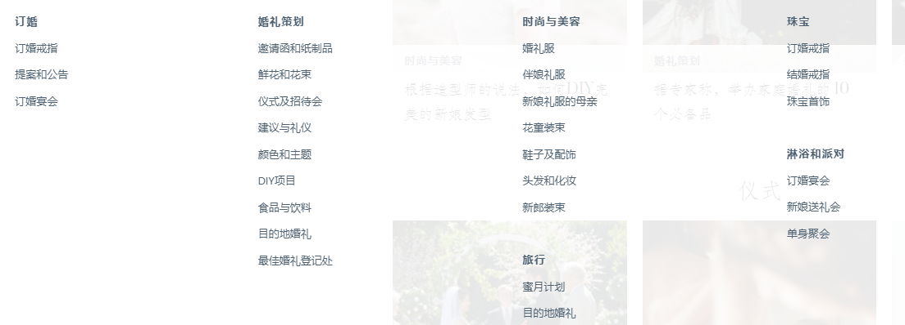

- [Zola是一个**在线婚礼产品选购平台**，主打结婚购物及礼物清单](https://www.zola.com/)

  Zola是一个**既包含图片、又包含婚礼建议等内容、同时还包含未婚夫妇意愿礼物清单的网站。**

  创始人Kevin Ryan创建Zola，是希望未婚夫妇通过这个网站可以讲述专属于他们自己的婚礼故事。

  通过这个网站，不仅未婚夫妇可以获得心仪的礼物，向未婚夫妇赠送礼物的宾客也享受了“送礼”的乐趣。

- [Ewedding是一个**帮助用户建立婚庆服务**的网站](https://www.ewedding.com/)

  解雇策划人，我们全天候为您服务。
  
  Ewedding的创始人成立这个网站的主要原因在于与家庭和朋友分享其订婚消息，添加更多的信息告诉大家其婚礼计划。
  
  通过Ewedding网站提供的服务，你可以发布日期，指南，快捷回复，注册信息，上传无限的图片并随时做出更改。你甚至可以更改网站的主题。
  
  Ewedding允许你的客户快捷回复，节约时间和邮票。你可以采集各类餐饮选择和其他的喜好。
  
- [据说发展最快的站, 包含了场地、蛋糕、服装、请柬、策划和指导多方面的服务](https://www.weddingwire.com/)
  

  WeddingWire公司作为美国国内首屈一指的婚庆服务公司，其座右铭是“需求是所有发明之母”。

  WeddingWire公司的使命是**让婚礼和仪式策划更有效率和透明**。

- https://www.mywedding.com/
  

