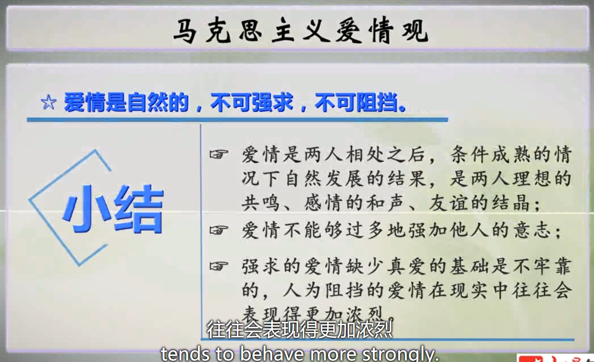
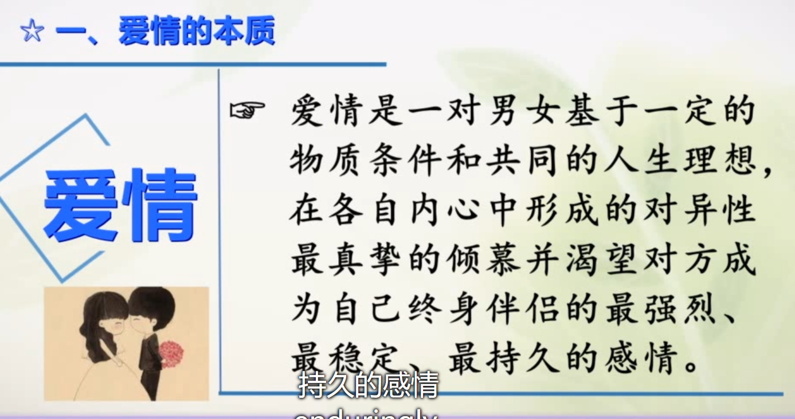
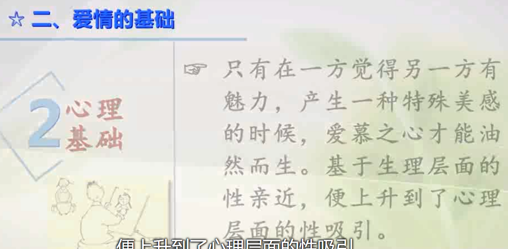
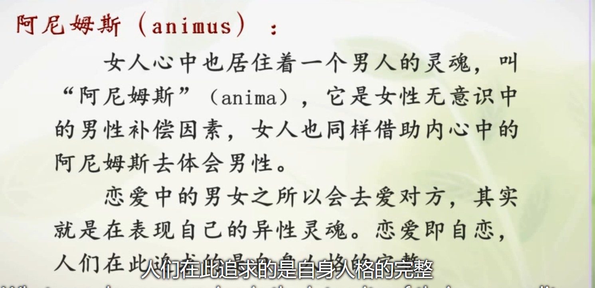
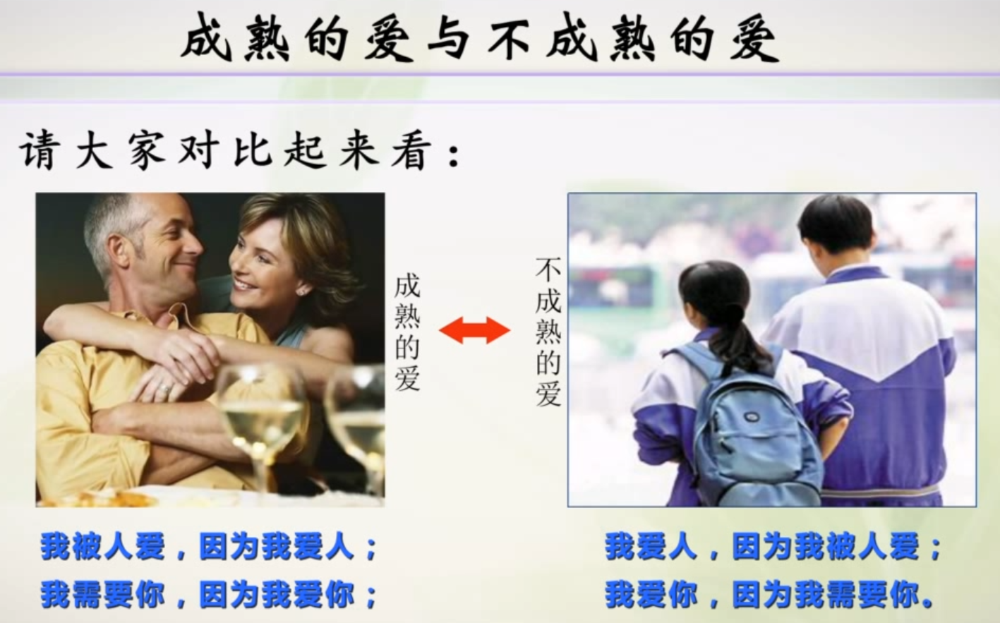

[toc]
------

# 进度

- 2021-05-10 23:32 1.1
- 

1.马克思主义爱情观有哪几个方面的内容。爱情的本质和基础是什么。

2.柏拉图的爱情观包括哪几个方面。柏拉图式爱情的内涵是什么。两者有什么相同点和不同之处。

3.《情爱论》中，瓦西列夫认为爱情是什么，爱情的本质是什么。他对于男女平等是怎样看待的。

## 1.1

我需要你，因为我爱你，我被人爱，因为我爱人。

- 

