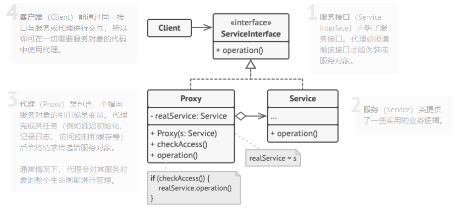
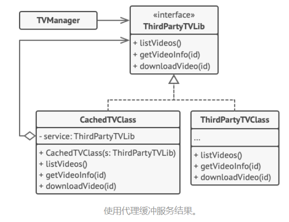

# 代理模式结构

# 代理模式例子

## 1 视频缓存

# 代理模式使用场景

- 延迟初始化, 如果有一个重量级服务类, 一直保持该对象运行会很耗资源, 这时候可以使用代理模式;
- 记录日志
- 访问控制
- 缓存
- ...

# 实现方式

1. 如果没有现成的服务接口， 你就需要创建一个接口来实现代理和服务对象的可交换性。 从服务类中抽取接口并非总是可行的， 因为你需要对服务的所有客户端进行修改， 让它们使用接口。 备选计划是将代理作为服务类的子类， 这样代理就能继承服务的所有接口了。
2. 创建代理类， 其中必须包含一个存储指向服务的引用的成员变量。 通常情况下， 代理负责创建服务并对其整个生命周期进行管理。 在一些特殊情况下， 客户端会通过构造函数将服务传递给代理。
3. 根据需求实现代理方法。 在大部分情况下， 代理在完成一些任务后应将工作委派给服务对象。

# 识别代理

 代理模式会将所有实际工作委派给一些其他对象。 除非代理是某个服务的子类， 否则每个代理方法最后都应该引用一个服务对象。

