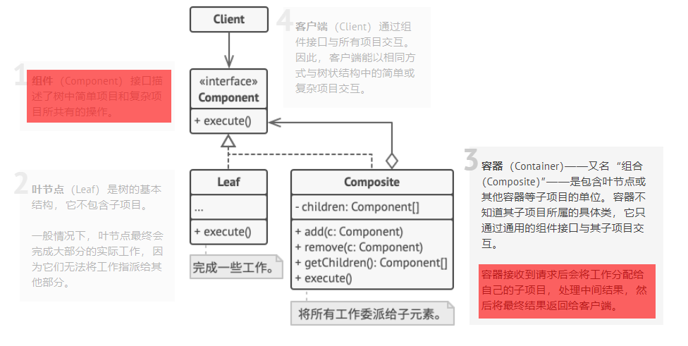
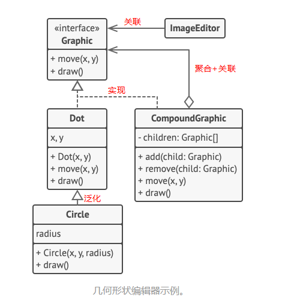
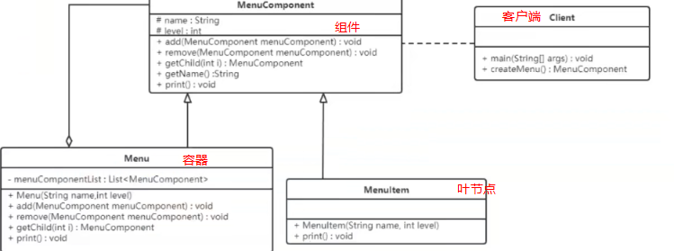

> # 组合模式
>
> 亦称： 对象树、Object Tree、Composite

# 何为组合模式

- 假设有一个盒子, 盒子里有玩具和盒子, 盒子里又有玩具和盒子
  - 如何计算他们的价钱呢?
    - 声明一个通用接口, 其中写了计算总价的方法;
    - 这个方法对于玩具直接返回价钱,  对于一个盒子， 该方法遍历盒子中的所有项目， 询问每个项目的价格， 然后返回该盒子的总价格。
    - 甚至可以在盒子的最终价格中增加额外费用， 作为该盒子的包装费用。

# 实际例子

## 图形编辑器

## 文件夹(这个好理解, 黑马的公开课上的)

# 组合的应用场景

- 对于绝大多数需要生成树状结构的问题来说， 组合都是非常受欢迎的解决方案。 组合最主要的功能是在整个树状结构上递归调用方法并对结果进行汇总。

