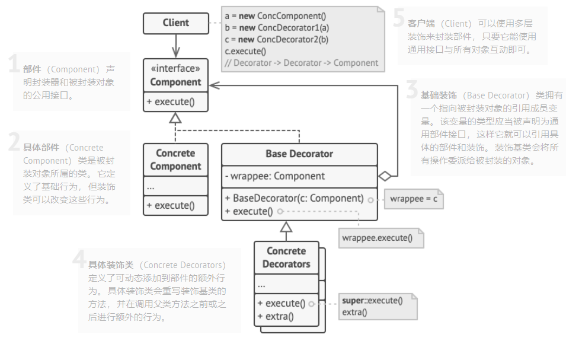
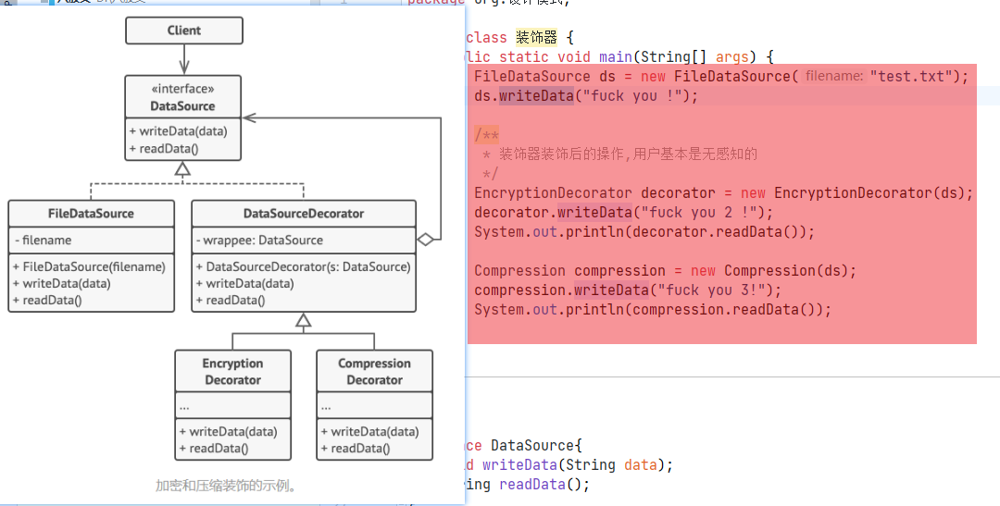
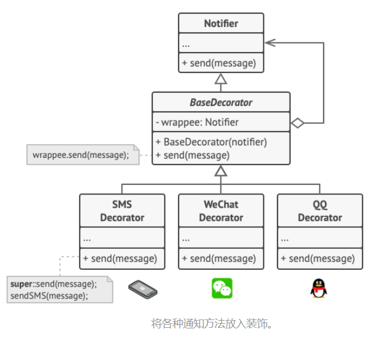
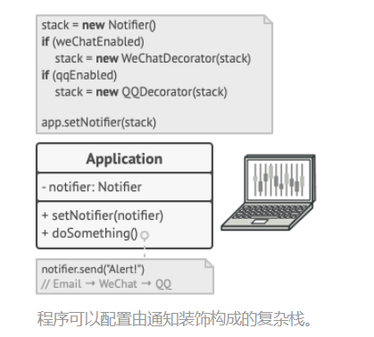

# 啥是装饰者模式(套娃模式)

- 允许把对象放入包含特殊行为的对象中来为原来对象绑定新的行为;
  - 比如把FileDataSource对象放入EncryptionDecorator装饰器对象中来为FileDataSource绑定加密行为;

- *封装器*是装饰模式的别称， 这个称谓明确地表达了该模式的主要思想。  “封装器” 是一个能与其他 “目标” 对象连接的对象。 封装器包含与目标对象相同的一系列方法， 它会将所有接收到的请求委派给目标对象。 但是， 封装器可以在将请求委派给目标前后对其进行处理， 所以可能会改变最终结果。
  - EncryptionDecorator是一个能与其他被封装目标,如FileDataSource连接的对象, 加密装饰器包含目标对象FIleDataSource相同的一套方法(从DataSource接口得来), 装饰器会把所有请求委托给FileDataSource, 比如读写, 但是装饰器在请求委派给目标对象的前后对其进行了加密解密的处理;
- 只要所有装饰都遵循相同的接口， 客户端就可以使用任意自定义的装饰来装饰对象。
  - 比如所有的读写文件的装饰器都实现DataSourceDecorator接口, Client就可以使用任意自定义的装饰器来装饰对象;

# 如何识别装饰模式

- 装饰可通过以当前类或对象为参数的创建方法或构造函数来识别。

# 装饰模式使用场景

- 无需修改具体部件代码的情况下就可为对象新增额外的行为;
- 如果使用继承来拓展对象的方案不可行或者难以实现, 可以使用装饰模式;
- 可以用装饰器模式封装复用一些final修饰的最终类;

# 装饰模式的实现方式

- 首先业务能够使用一个基本部件和多个可选装饰表示;
- 找出基本组件和可选装饰的通用方法, 创建一个组件接口并声明这些方法;
- 撞见具体组件类, 定义基础通用方法(实现上面的接口);
- 创建装饰基类, 使用一个变量存储被封装对象的引用; 这个变量需要声明为组件接口类型, 从而能在运行时连接具体组件和装饰; 装饰基类必须把所有工作委派给被封装的具体组件类;
- 将装饰基类扩展为具体装饰器, 具体装饰器必须在调用父类方法(装饰基类)之前或之后执行自己的行为;

- 客户端代码负责创建具体装饰器, 并将其组合(套娃)成客户端所需要的形式;

# 装饰模式例子

## 读写文件, 压缩/加密装饰器装饰读写文件

## 通知器, QQ/微信/邮件等装饰器装饰通知

