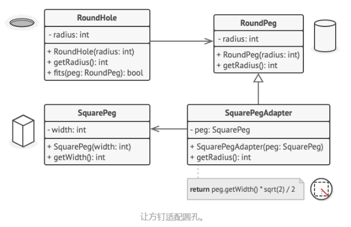

# 什么是适配器模式

- 一个特殊的对象，能转换对象接口，使其能与其他对象进行交互；
- 适配器模式通过封装对象将复杂的转换过程隐藏于幕后。 被封装的对象甚至察觉不到适配器的存在。
- 适配器可担任两个对象间的封装器， 它会接收对于一个对象的调用， 并将其转换为另一个对象可识别的格式和接口。

# 适配器模式的实例

## 1 方钉与圆孔

- V1: 有RoundHole和RoundPeg两个类时, 圆孔调用fits方法可以传入圆钉, 方法返回true, 表示可以适配;
- V2: 加入了方钉, 圆孔调用fits方法传入方钉, 无法编译, 因为圆孔没有接收SquarePeg的重载方法;
- V3: 加入了SquarePegAdapter, 这个适配器泛化(继承)了圆钉, 这个适配器类有一个接收方钉的构造方法, 用一个变量引用方钉, 重写了getRadius用于计算方钉横切面外界圆的半径, 
  - 这个时候: 调用圆孔的fits方法, 传入方钉的适配器, 就ok了
- 完成! 达到了用圆孔适配方钉的目的!

## 2 xml 与 Json

# Java中的适配器模式

# 如何鉴别适配器模式

- 适配器可以通过以不同抽象或接口类型实例为参数的构造函数来识别。 当适配器的任何方法被调用时， 它会将参数转换为合适的格式， 然后将调用定向到其封装对象中的一个或多个方法。