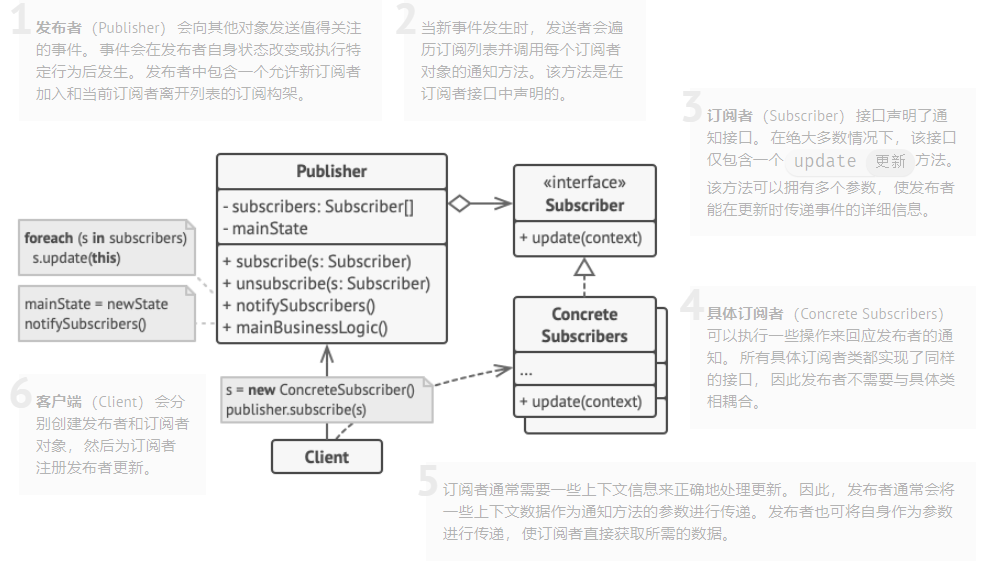
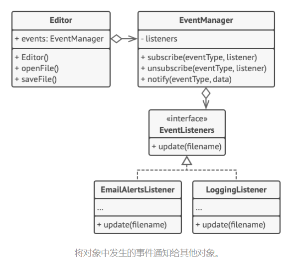

> # 观察者模式
>
> 亦称： 事件订阅者、监听者、Event-Subscriber、Listener、Observer
>
> - 目标: 拥有一些值得关注的状态的对象通常被称为目标;
> - 发布者: 由于目标要将自身的状态改变通知给其他对象， 我们也将其称为*发布者* publisher。 
> - 订阅者: 所有希望关注发布者状态变化的其他对象被称为*订阅者* （subscribers）。

# 啥是观察者模式

- 允许你定义一种订阅机制， 可在对象事件发生时通知多个 “观察” 该对象的其他对象。

# 实例

## 文本编辑器对象将自身的状态改变通知给其他服务对象

# 使用场景

-  **当一个对象状态的改变需要改变其他对象****，** **或实际对象是事先未知的或动态变化的时****，** **可使用观察者模式****。**
- **当应用中的一些对象必须观察其他对象时****，** **可使用该模式****。** 