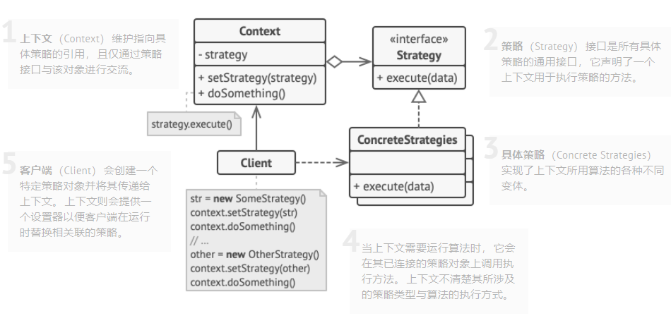

> # 策略模式
>
> > 就是，，，，，算法模式
>
> - 策略(完成一件事的不同方法)
>   - 找出负责用许多不同方式完成特定任务的类， 然后将其中的算法抽取到一组被称为**策略**的独立类中。
>
> - 上下文(原始的类)
>   - 名为**上下文**的原始类必须包含一个成员变量来存储对于每种策略的引用。 上下文并不执行任务， 而是将工作委派给已连接的策略对象。
>   - 上下文不负责选择符合任务需要的算法——客户端会将所需策略传递给上下文。 实际上， 上下文并不十分了解策略， 它会通过同样的通用接口与所有策略进行交互， 而该接口只需暴露一个方法来触发所选策略中封装的算法即可。
>
> 

# 啥是策略模式?

- 它能让你定义一系列算法， 并将每种算法分别放入独立的类中， 以使算法的对象能够相互替换。

# 这个感觉简单

- 上下文维护一个变量, 变量指向一个策略接口; 上下文提供了一个切换策略的接口;
- 策略接口的许多实现类中有许多算法;
- 客户端可以创建上下文, 选择一个策略, 然后该干啥干啥!!!~~~~~~~

# 2022-06-18 21:03