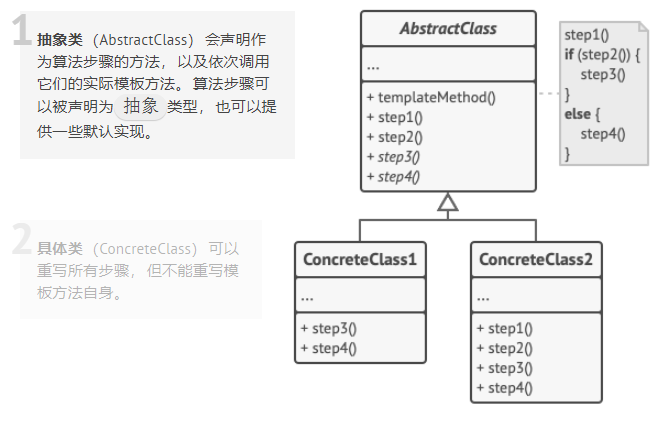

> 它在超类中定义了一个算法的框架， 允许子类在不修改结构的情况下重写算法的特定步骤。

## 注意

- 抽象类定义了一个模板方法，其中通常会包含某个由抽象原语操作调用组成的算

  法框架。具体子类会实现这些操作，但是不会对模板方法做出修改。

- 模板方法定义了某个算法的框架。

- 某些步骤可在基类中直接实现。

- 某些可定义为抽象类型。

- 一个类可包含多个模板方法。

- 具体类必须实现基类中的所有抽象操作，但是它们不能重写模板方法自身。

- 子类可以重写部分默认的操作。