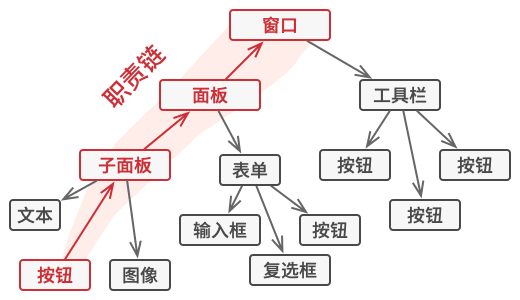

> **亦称：**职责链模式、命令链、CoR、Chain of Command、Chain of Responsibility

# 何为责任链?

- 允许你将请求沿着处理者链进行发送。 收到请求后， 每个处理者均可对请求进行处理， 或将其传递给链上的下个处理者。

# 责任链的现实例子

- UI程序点击按钮后的逻辑调用
  
- 打客服电话的流程
  - 嘟嘟嘟, 机械机器人接听了你的电话, 无法解决你的问题, 你点击0接入人工
  - 嘟嘟嘟, 人工小姐姐接听了你的电话, 小姐姐翻阅手册后无法解决问题, 你申请一位工程师帮助
  - 嘟嘟嘟, 一个在昏暗地下室的高级Java工程师接听了你的电话, 问题解决!

# 责任链实现例子

## 为活动的 GUI 元素显示上下文帮助信息

- 当用户将鼠标指针移动到某个元素并按下 `F1`键时， 程序检测到指针下的组件并对其发送帮助请求。 该请求不断向上传递到该元素所有的容器， 直至某个元素能够显示帮助信息。

  

  

# 责任链模式使用场景

-  **当程序需要使用不同方式处理不同种类请求**， **而且请求类型和顺序预先未知时，** 可以使用责任链模式;
  - 该模式能将多个处理者连接成一条链。 接收到请求后， 它会 “询问” 每个处理者是否能够对其进行处理。 这样所有处理者都有机会来处理请求。
-  当必须按顺序执行多个处理者时， 可以使用该模式。
  - 无论你以何种顺序将处理者连接成一条链， 所有请求都会严格按照顺序通过链上的处理者。
-  如果所需处理者及其顺序必须在运行时进行改变， 可以使用责任链模式。
  - 如果在处理者类中有对引用成员变量的设定方法， 你将能动态地插入和移除处理者， 或者改变其顺序。

# 不是很理解~~~2022-06-18 20:05

